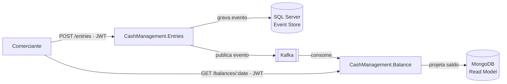

# Cash Management — Controle de Caixa Diário

        

Solução para um **comerciante** controlar seu fluxo de caixa diário: registrar
**lançamentos** (débitos e créditos) e consultar o **saldo consolidado** de cada
dia.

A solução é composta por **dois serviços independentes**, comunicando-se de
forma assíncrona via **Kafka**, de modo que o registro de lançamentos continue
disponível mesmo que o consolidado esteja fora do ar.

> 📐 **Decisões de arquitetura, trade-offs e justificativas completas:**
> [`docs/ARCHITECTURE.md`](docs/ARCHITECTURE.md).

---

## Índice

- [O problema de negócio](#o-problema-de-negócio)
- [Como funciona](#como-funciona-visão-rápida)
- [Stack](#stack)
- [Estrutura do repositório](#estrutura-do-repositório)
- [Como rodar localmente](#como-rodar-localmente)
- [API (Postman)](#api-postman)
- [Testes](#testes)
- [Documentação](#documentação)
- [Licença](#licença)
- [Autor](#autor)

---

## O problema de negócio


|                         |                                                                                               |
| ----------------------- | --------------------------------------------------------------------------------------------- |
| **Lançamentos**        | Registrar cada movimentação financeira (débito/crédito) de forma confiável e auditável. |
| **Consolidado Diário** | Agregar os lançamentos de um dia e expor o saldo consolidado para consulta.                  |

Dois requisitos não funcionais guiam o desenho:

1. **Lançamentos não pode cair se o Consolidado cair.**
2. Em picos, o **Consolidado** recebe até **50 req/s**, tolerando **≤ 5%** de
   perda.

---

## Como funciona (visão rápida)



1. O comerciante registra um lançamento em **Entries** (`POST /entries`).
2. Entries grava o evento (Event Sourcing, SQL Server) e o publica no Kafka.
3. **Balance** consome o evento de forma assíncrona e atualiza a projeção do
   saldo do dia no MongoDB.
4. O comerciante consulta o saldo em **Balance** (`GET /balances/{date}`), que
   responde direto da projeção — sem nunca chamar o Entries.

Detalhe do fluxo, identificadores (idempotência/rastreabilidade) e o contrato
das mensagens Kafka: [`docs/ARCHITECTURE.md`](docs/ARCHITECTURE.md).

---

## Stack


| Camada                      | Tecnologia                                                                   |
| --------------------------- | ---------------------------------------------------------------------------- |
| Linguagem / runtime         | .NET 10 / C# 14                                                              |
| Event Store (Lançamentos)  | SQL Server                                                                   |
| Read Model (Consolidado)    | MongoDB                                                                      |
| Mensageria                  | Apache Kafka                                                                 |
| API externa                 | REST/HTTP + JWT                                                              |
| Building blocks de domínio | Próprios (DDD/CQRS/ES, padrão Given/When/Then) — sem dependência externa |
| Testes                      | TDD (Given/When/Then) + Testcontainers + k6/NBomber                          |
| Execução local            | Docker + docker-compose                                                      |

A escolha de cada tecnologia está justificada (com trade-offs) na seção 5 de
[`docs/ARCHITECTURE.md`](docs/ARCHITECTURE.md#5-decisões-de-arquitetura-e-justificativas).

---

## Estrutura do repositório

```
cash-management/
├── docs/
│   ├── ARCHITECTURE.md          # Design Doc — domínio, requisitos, decisões, CI/CD, trade-offs
│   ├── TASKS.md                 # Regras de uso de IA + backlog de tarefas (TDD)
│   ├── observability/           # Config do OTel Collector (profile observability)
│   └── postman/                 # Collection + environment para testar a API
├── src/
│   ├── CashManagement.Entries/  # Serviço de Lançamentos (Clean Architecture + Event Sourcing)
│   │   └── ...Api/Dockerfile    # Imagem multi-stage do Entries
│   └── CashManagement.Balance/  # Serviço de Consolidado (projeção/read model — CQRS)
│       └── ...Api/Dockerfile    # Imagem multi-stage do Balance
├── .dockerignore                # Exclui bin/obj/.vs/etc. do contexto de build
└── docker-compose.yml           # Sobe os 2 serviços + SQL Server, MongoDB, Kafka (+ profile observability)
```

Cada serviço tem seu próprio README com a estrutura interna detalhada:
[Entries](src/CashManagement.Entries/README.md) ·
[Balance](src/CashManagement.Balance/README.md).

---

## Como rodar localmente

**Pré-requisitos:** [Docker](https://docs.docker.com/get-docker/) e Docker
Compose instalados.

```bash
git clone https://github.com/pinhosilva/cash-management.git
cd cash-management
docker compose up --build
```

Um único comando sobe toda a infraestrutura (SQL Server, MongoDB, Kafka em modo
KRaft) e os dois serviços .NET. As infras têm **healthcheck** e os serviços só
sobem (`depends_on: condition: service_healthy`) quando as dependências estão
prontas. Os serviços também expõem healthcheck no compose via `/health/ready`.

### Modos de subida (`--profile`)

A subida básica é **leve**; as ferramentas de inspeção (UI/observabilidade) ficam em
**profiles opcionais**, pra não pesar. Combine conforme o que quer ver:

| Comando | O que sobe | UI no navegador |
| --- | --- | --- |
| `docker compose up --build` | **base** — 2 serviços + SQL + Mongo + Kafka | Swagger `8080`/`8081` |
| `docker compose --profile tools up --build` | base + **Kafka UI** | + `:8088` |
| `docker compose --profile observability up --build` | base + **OpenSearch + Dashboards + OTel** | + `:5601` |
| `docker compose --profile tools --profile observability up --build` | **tudo** (app + UIs + observabilidade) | `:8088` + `:5601` |

> **Por que profiles?** O OpenSearch é **pesado** (RAM); deixá-lo opt-in mantém o `up`
> básico leve e rápido (§9.1). O Kafka UI é leve, mas também fica em profile (`tools`)
> pra você ligar só quando quiser inspecionar os eventos. As **rotas** ficam
> documentadas e testáveis no **Swagger** de cada serviço (`/swagger`) e na collection
> **Postman** (abaixo).

Para derrubar e limpar a stack:

```bash
docker compose down          # remove containers e rede
docker compose down -v       # idem + apaga os volumes (zera SQL/Mongo/Kafka)
```

### Portas


| Serviço / infra        | Porta no host | Uso                                                                        |
| ----------------------- | ------------- | -------------------------------------------------------------------------- |
| **entries-api**         | `8080`        | `POST /entries`, `GET /dev/token` (escrita), `/health/*`, `/swagger`       |
| **balance-api**         | `8081`        | `GET /balances/{date}`, `GET /dev/token` (leitura), `/health/*`, `/swagger`|
| sqlserver               | `1433`        | Event Store (Entries)                                                       |
| mongodb                 | `27017`       | Read Model (Balance)                                                        |
| kafka                   | `9092`        | Mensageria (KRaft, sem Zookeeper)                                           |
| **kafka-ui**            | `8088`        | **UI dos tópicos/eventos** (profile `tools`) — http://localhost:8088        |
| opensearch              | `9200`        | Logs (profile `observability`)                                             |
| opensearch-dashboards   | `5601`        | UI de logs / OTel (profile `observability`) — http://localhost:5601         |

### Endpoints principais


| Serviço | Método | Rota                              | Descrição                                                      |
| -------- | ------- | --------------------------------- | ---------------------------------------------------------------- |
| Entries  | `POST`  | `/entries`                        | Registra um lançamento (crédito). Requer JWT `entries:write`.   |
| Entries  | `GET`   | `/dev/token`                      | Token de dev com scope `entries:write` (404 em produção).      |
| Balance  | `GET`   | `/balances/{date}`                | Retorna o saldo consolidado de uma data. Requer JWT `balances:read`. |
| Balance  | `GET`   | `/dev/token`                      | Token de dev com scope `balances:read` (404 em produção).      |
| Ambos    | `GET`   | `/health/live` · `/health/ready` | *Liveness*/*readiness* para orquestração (sem autenticação). |

### Exemplos com `curl`

Dois tokens distintos: o `POST /entries` exige o token de **escrita** do Entries
e o `GET /balances/{date}` exige o token de **leitura** do Balance. Cada serviço
valida o token assinado pela **sua própria** chave (audiences/chaves distintas).
O `/dev/token` é um **GET** e devolve `{ "access_token": "...", "token_type": "Bearer" }`.

```bash
# 1) Token de escrita (Entries) e registro de um crédito
WRITE_TOKEN=$(curl -s http://localhost:8080/dev/token | jq -r .access_token)

curl -s -X POST http://localhost:8080/entries \
  -H "Authorization: Bearer $WRITE_TOKEN" \
  -H "Content-Type: application/json" \
  -H "Idempotency-Key: $(uuidgen)" \
  -H "X-Correlation-Id: $(uuidgen)" \
  -d '{ "type": "Credit", "amount": 123.45, "occurredAt": "2026-06-26T10:00:00Z" }'

# 2) Token de leitura (Balance) e consulta do saldo do dia
READ_TOKEN=$(curl -s http://localhost:8081/dev/token | jq -r .access_token)

curl -s http://localhost:8081/balances/2026-06-26 \
  -H "Authorization: Bearer $READ_TOKEN"
# A projeção é assíncrona (consistência eventual): se o saldo ainda não refletiu
# o crédito, repita a consulta após ~1-2s.
```

---

## API (Postman)

A pasta [`docs/postman/`](docs/postman/) traz uma **collection** pronta para
importar no Postman, com cenários de teste já configurados (crédito, débito,
estorno, idempotência, `401` sem token e health checks) e um **environment**
local.

A collection é organizada em pastas: **`Smoke`** é o caminho crítico que a
**CI/CD gateia** (`newman --folder "Smoke"`, com polling no saldo); as demais
(**Auth / Entries / Balance / Health**) são o catálogo completo para você
explorar — e ficam **fora** do gate de deploy.

1. Importe `CashManagement.postman_collection.json` e
   `CashManagement.postman_environment.json`.
2. Selecione o environment **Cash Management — Local** (`entries_url`/`balance_url`
   já apontam para `8080`/`8081`).
3. O fluxo do `Smoke` é o **dois tokens**: obtém o token de **escrita** no Entries
   → registra o crédito → obtém o token de **leitura** no Balance → consulta o
   saldo (com **polling**) → request sem token retorna `401`.

### Smoke via Newman (a prova da fatia)

Com a stack no ar (`docker compose up --build`), rode **só a pasta `Smoke`**:

```bash
# Local (Newman instalado via npm)
newman run docs/postman/CashManagement.postman_collection.json \
  -e docs/postman/CashManagement.postman_environment.json \
  --folder "Smoke" --delay-request 1000

# Sem instalar nada (imagem oficial, na rede do compose)
docker run --rm --network cash-management_default \
  -v "$PWD/docs/postman:/etc/newman" postman/newman:alpine \
  run CashManagement.postman_collection.json \
  -e CashManagement.postman_environment.json \
  --folder "Smoke" --delay-request 1000 \
  --env-var entries_url=http://entries-api:8080 \
  --env-var balance_url=http://balance-api:8081
```

> O `--delay-request 1000` é obrigatório: dá espaço entre os *polls* do saldo
> para a projeção assíncrona (consistência eventual) refletir o crédito.

---

## Validar tudo (passo a passo)

**1. Automático — a prova da fatia.** Com a stack no ar, rode o `Smoke` via Newman
(seção acima): token → crédito → saldo (com polling) → `401`. Verde = fluxo OK.

**2. Visual — ver acontecendo.** Suba com os dois profiles
(`docker compose --profile tools --profile observability up --build`) e siga:

| # | Onde | Faça | Veja |
| --- | --- | --- | --- |
| 1 | **Swagger Entries** — http://localhost:8080/swagger | `GET /dev/token` → copie o `access_token` → `POST /entries` (Authorize com o Bearer) | `201 Created` + `{ id }` |
| 2 | **Kafka UI** — http://localhost:8088 | Topics → `cash.management.entries.events` → **Messages** | o **`CreditPostedEvent`** (envelope §4.3 no corpo) |
| 3 | **Kafka UI** — http://localhost:8088 | **Consumers** | o **consumer lag** do Balance indo a `0` (ele consumiu) |
| 4 | **Swagger Balance** — http://localhost:8081/swagger | `GET /dev/token` → `GET /balances/{data de hoje}` | o **saldo** refletindo o crédito (eventual; repita se preciso) |
| 5 | **OpenSearch Dashboards** — http://localhost:5601 | *Discover* (index `cash-management-logs*`) → filtre por `attributes.correlationId` | os **logs dos dois serviços** na mesma requisição |

Isso exercita o ciclo inteiro — **`POST` → Event Sourcing + Outbox → Kafka →
projeção → `GET`** — e você **vê** cada elo: o evento no Kafka UI e os logs
correlacionados (ponta a ponta) no Dashboards.

---

## Observabilidade (profile opcional)

A stack de logs centralizados sobe **sob demanda**, para não pesar a subida
básica (§9.1):

```bash
docker compose --profile observability up --build
```

Isso adiciona **OpenSearch** (`9200`), **OpenSearch Dashboards** (`5601`) e um
**OpenTelemetry Collector**. O Collector **não instrumenta o código** dos
serviços (traces/métricas OTel são fatia futura — §8.2): ele apenas *taila* os
logs de stdout (JSON estruturado do Serilog) dos containers e os exporta para o
OpenSearch, num índice `cash-management-logs`, pesquisável por `correlationId`.

Os campos do log estruturado do Serilog (incl. `correlationId`, `service`,
`component`) ficam sob `attributes.*` no documento do OpenSearch. Verificação
rápida (após gerar tráfego, ex.: rodar o `Smoke` ou um `POST /entries`):

```bash
# Conta documentos de log ingeridos
curl -s "http://localhost:9200/cash-management-logs/_count"

# Quais serviços já indexaram logs
curl -s "http://localhost:9200/cash-management-logs/_search" \
  -H 'Content-Type: application/json' \
  -d '{"size":0,"aggs":{"svc":{"terms":{"field":"attributes.service.keyword"}}}}'

# Tudo de uma requisição pelo correlationId (cruza os dois serviços).
# Use o mesmo X-Correlation-Id que você enviou no POST /entries.
curl -s "http://localhost:9200/cash-management-logs/_search" \
  -H 'Content-Type: application/json' \
  -d '{"query":{"match":{"attributes.correlationId":"<seu-correlation-id>"}}}'
```

Pelos Dashboards (`http://localhost:5601` → *Discover*), crie um index pattern
`cash-management-logs*` e filtre por `attributes.correlationId`.

---

## Ferramentas de dev (profile `tools`)

Pra **inspecionar o sistema rodando** pelo navegador, sem pesar a subida básica:

```bash
docker compose --profile tools up --build                            # app + Kafka UI
docker compose --profile tools --profile observability up --build    # + OpenSearch/OTel
```

- **Kafka UI** → http://localhost:8088 — vê os **tópicos, mensagens e consumer lag**.
  Depois de um `POST /entries`, o evento aparece no tópico
  `cash.management.entries.events` (o envelope §4.3 no corpo), e dá pra acompanhar o
  **lag do consumer do Balance** ali — a métrica-chave da consistência eventual (§8.2).
- **OpenSearch Dashboards (OTel)** → http://localhost:5601 — *Discover* (index pattern
  `cash-management-logs*`) pra ver os **logs estruturados** dos dois serviços e seguir
  uma requisição inteira pelo `correlationId`, cruzando Entries e Balance.

---

## Testes

A estratégia de testes (níveis, o que cada um cobre e como os pontos críticos —
idempotência, concorrência e a carga de 50 req/s — são validados) está descrita
na seção de Testes de [`docs/ARCHITECTURE.md`](docs/ARCHITECTURE.md).

---

## CI/CD (GitHub Actions)

Um workflow só ([`ci-cd.yml`](.github/workflows/ci-cd.yml)) — CI + CD juntos, para
o `deploy` poder gatear no CI via `needs:` (que **não** cruza arquivos). Desenho
completo na [§9.2 do ARCHITECTURE](docs/ARCHITECTURE.md#92-esteira-de-cicd-github-actions).

**CI (roda em PR e em push)** com **jobs isolados por projeto** (quando quebra, dá
pra ver de imediato qual é):
- **`entries`** e **`balance`** — um job por solução (`*.sln`), cada um com **unit +
  integração** (Testcontainers). Em **paralelo**, isolam a falha por serviço.
- **`security`** (cross-cutting, paralelo) — secret scan (**gitleaks**), **SAST**
  (**CodeQL** C#) e dependências vulneráveis (`dotnet list --vulnerable` + `NuGetAudit`).
- **`e2e`** (`needs: entries, balance`) — sobe a stack do `docker compose`, roda a
  pasta **Smoke** (**Newman**) e o scan das imagens (**Trivy**, report-only).

**CD — `deploy`** (`needs: e2e, security`; `if` push em develop/main/release, nunca
em PR): build + **push das imagens pro GHCR** (`ghcr.io/<owner>/cash-management-*`,
versionadas por SemVer + short sha; na main também `latest`); **deploy-test** —
sobe a stack com as **imagens publicadas** ([`docker-compose.ghcr.yml`](docker-compose.ghcr.yml))
e roda o Smoke contra elas (prova o *build once*: testa o **artefato**, não o build
local); deploy por ambiente (placeholder) e **release por canal** — develop →
`alpha`, release/* → `rc` (pre-release), main → estável. Como está no **mesmo
workflow**, o `deploy` só roda **depois** que o CI passou (`needs`); em PR aparece **skipped**.

- **[`dependabot.yml`](.github/dependabot.yml)** — PRs automáticos de update (NuGet,
  GitHub Actions, imagens base Docker), com minor+patch agrupados e majors isolados.
- **Versionamento** — [`GitVersion.yml`](GitVersion.yml) calcula o SemVer dos
  **commits semânticos** (`feat` → minor, `fix` → patch, `!`/`BREAKING` → major).

### Configuração no GitHub (uma vez, na UI — não dá para versionar)

1. **Branch protection** em `main` **e** `develop` (*Settings → Branches → Add rule*):
   - *Require a pull request before merging* (com 1 review).
   - *Require status checks to pass* → selecione os checks do CI: **`entries`**,
     **`balance`**, **`security`** e **`e2e`** (gateiam o **merge**). O `deploy` em si
     é gateado pelo `needs: [e2e, security]` dentro do workflow.
   - (Recomendado) *Require branches to be up to date* e *Do not allow bypassing*.
2. **Secrets/permissions** — usa só o `GITHUB_TOKEN` automático (o job `deploy` declara
   `permissions: contents: write` para tags/releases). Deploy real para nuvem exigirá
   *secrets* próprios (registry, kubeconfig) quando o ambiente existir.

---

## Documentação


| Documento                                              | Conteúdo                                                                                                                                     |
| ------------------------------------------------------ | --------------------------------------------------------------------------------------------------------------------------------------------- |
| [`docs/ARCHITECTURE.md`](docs/ARCHITECTURE.md)         | Design Doc completo: domínio, capacidades, requisitos, arquitetura alvo, decisões, segurança, observabilidade, custos e evolução futura. |
| [`docs/TASKS.md`](docs/TASKS.md) | Guia de implementação: regras de engajamento + backlog de tarefas (TDD) da 1ª fatia vertical. |
| [Entries README](src/CashManagement.Entries/README.md) | Estrutura interna do serviço de Lançamentos.                                                                                                |
| [Balance README](src/CashManagement.Balance/README.md) | Estrutura interna do serviço de Consolidado.                                                                                                 |

---

## Licença

Distribuído sob a licença **MIT** — veja [`LICENSE`](LICENSE).

---

## Autor

**Rafael Pinho**

- GitHub: [@pinhosilva](https://github.com/pinhosilva)
- LinkedIn: [in/pinhosilva](https://www.linkedin.com/in/pinhosilva/)