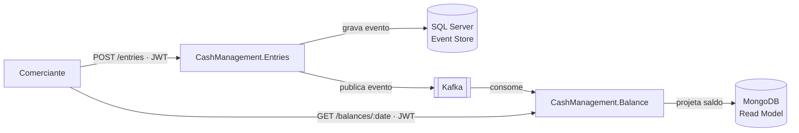

# Cash Management — Controle de Caixa Diário

        

Solução para um **comerciante** controlar seu fluxo de caixa diário: registrar
**lançamentos** (débitos e créditos) e consultar o **saldo consolidado** de cada
dia.

A solução é composta por **dois serviços independentes**, comunicando-se de
forma assíncrona via **Kafka**, de modo que o registro de lançamentos continue
disponível mesmo que o consolidado esteja fora do ar.

> 📐 **Decisões de arquitetura, trade-offs e justificativas completas:**
> [`docs/ARCHITECTURE.md`](docs/ARCHITECTURE.md).

---

## Índice

- [O problema de negócio](#o-problema-de-negócio)
- [Como funciona](#como-funciona-visão-rápida)
- [Stack](#stack)
- [Estrutura do repositório](#estrutura-do-repositório)
- [Como rodar localmente](#como-rodar-localmente)
- [API (Postman)](#api-postman)
- [Testes](#testes)
- [Documentação](#documentação)
- [Licença](#licença)
- [Autor](#autor)

---

## O problema de negócio


|                         |                                                                                               |
| ----------------------- | --------------------------------------------------------------------------------------------- |
| **Lançamentos**        | Registrar cada movimentação financeira (débito/crédito) de forma confiável e auditável. |
| **Consolidado Diário** | Agregar os lançamentos de um dia e expor o saldo consolidado para consulta.                  |

Dois requisitos não funcionais guiam o desenho:

1. **Lançamentos não pode cair se o Consolidado cair.**
2. Em picos, o **Consolidado** recebe até **50 req/s**, tolerando **≤ 5%** de
   perda.

---

## Como funciona (visão rápida)



1. O comerciante registra um lançamento em **Entries** (`POST /entries`).
2. Entries grava o evento (Event Sourcing, SQL Server) e o publica no Kafka.
3. **Balance** consome o evento de forma assíncrona e atualiza a projeção do
   saldo do dia no MongoDB.
4. O comerciante consulta o saldo em **Balance** (`GET /balances/{date}`), que
   responde direto da projeção — sem nunca chamar o Entries.

Detalhe do fluxo, identificadores (idempotência/rastreabilidade) e o contrato
das mensagens Kafka: [`docs/ARCHITECTURE.md`](docs/ARCHITECTURE.md).

---

## Stack


| Camada                      | Tecnologia                                                                   |
| --------------------------- | ---------------------------------------------------------------------------- |
| Linguagem / runtime         | .NET 10 / C# 14                                                              |
| Event Store (Lançamentos)  | SQL Server                                                                   |
| Read Model (Consolidado)    | MongoDB                                                                      |
| Mensageria                  | Apache Kafka                                                                 |
| API externa                 | REST/HTTP + JWT                                                              |
| Building blocks de domínio | Próprios (DDD/CQRS/ES, padrão Given/When/Then) — sem dependência externa |
| Testes                      | TDD (Given/When/Then) + Testcontainers + k6/NBomber                          |
| Execução local            | Docker + docker-compose                                                      |

A escolha de cada tecnologia está justificada (com trade-offs) na seção 5 de
[`docs/ARCHITECTURE.md`](docs/ARCHITECTURE.md#5-decisões-de-arquitetura-e-justificativas).

---

## Estrutura do repositório

```
cash-management/
├── docs/
│   ├── ARCHITECTURE.md          # Design Doc — domínio, requisitos, decisões, CI/CD, trade-offs
│   ├── TASKS.md                 # Regras de uso de IA + backlog de tarefas (TDD)
│   └── postman/                 # Collection + environment para testar a API
├── src/
│   ├── CashManagement.Entries/  # Serviço de Lançamentos (Clean Architecture + Event Sourcing)
│   └── CashManagement.Balance/  # Serviço de Consolidado (projeção/read model — CQRS)
└── docker-compose.yml           # Sobe os 2 serviços + SQL Server, MongoDB, Kafka
```

Cada serviço tem seu próprio README com a estrutura interna detalhada:
[Entries](src/CashManagement.Entries/README.md) ·
[Balance](src/CashManagement.Balance/README.md).

---

## Como rodar localmente

**Pré-requisitos:** [Docker](https://docs.docker.com/get-docker/) e Docker
Compose instalados.

```bash
git clone https://github.com/pinhosilva/cash-management.git
cd cash-management
docker-compose up --build
```

Um único comando sobe toda a infraestrutura (SQL Server, MongoDB, Kafka) e os
dois serviços .NET. Portas, variáveis de ambiente e endpoints detalhados de
cada serviço ficam documentados no README do respectivo serviço.

> ℹ️ A imagem desta seção será complementada com portas e exemplos de
> `curl` assim que o `docker-compose.yml` for adicionado (fase de código).

### Endpoints principais


| Serviço | Método | Rota                              | Descrição                                                      |
| -------- | ------- | --------------------------------- | ---------------------------------------------------------------- |
| Entries  | `POST`  | `/entries`                        | Registra um lançamento (débito/crédito). Requer JWT.          |
| Balance  | `GET`   | `/balances/{date}`                | Retorna o saldo consolidado de uma data. Requer JWT.             |
| Ambos    | `GET`   | `/health/live` · `/health/ready` | *Liveness*/*readiness* para orquestração (sem autenticação). |

---

## API (Postman)

A pasta [`docs/postman/`](docs/postman/) traz uma **collection** pronta para
importar no Postman, com cenários de teste já configurados (crédito, débito,
estorno, idempotência, `401` sem token e health checks) e um **environment**
local.

A collection é organizada em pastas: **`Smoke`** é o caminho crítico que a
**CI/CD gateia** (`newman --folder "Smoke"`, com polling no saldo); as demais
(**Auth / Entries / Balance / Health**) são o catálogo completo para você
explorar — e ficam **fora** do gate de deploy.

1. Importe `CashManagement.postman_collection.json` e
   `CashManagement.postman_environment.json`.
2. Selecione o environment **Cash Management — Local** e ajuste
   `entries_url` / `balance_url` se as portas mudarem.
3. Rode **Auth → Obter token de dev** para popular o `token`; depois execute os
   demais cenários (o `entryId` é encadeado automaticamente entre as chamadas).

---

## Testes

A estratégia de testes (níveis, o que cada um cobre e como os pontos críticos —
idempotência, concorrência e a carga de 50 req/s — são validados) está descrita
na seção de Testes de [`docs/ARCHITECTURE.md`](docs/ARCHITECTURE.md).

---

## Documentação


| Documento                                              | Conteúdo                                                                                                                                     |
| ------------------------------------------------------ | --------------------------------------------------------------------------------------------------------------------------------------------- |
| [`docs/ARCHITECTURE.md`](docs/ARCHITECTURE.md)         | Design Doc completo: domínio, capacidades, requisitos, arquitetura alvo, decisões, segurança, observabilidade, custos e evolução futura. |
| [`docs/TASKS.md`](docs/TASKS.md) | Guia de implementação: regras de engajamento + backlog de tarefas (TDD) da 1ª fatia vertical. |
| [Entries README](src/CashManagement.Entries/README.md) | Estrutura interna do serviço de Lançamentos.                                                                                                |
| [Balance README](src/CashManagement.Balance/README.md) | Estrutura interna do serviço de Consolidado.                                                                                                 |

---

## Licença

Distribuído sob a licença **MIT** — veja [`LICENSE`](LICENSE).

---

## Autor

**Rafael Pinho**

- GitHub: [@pinhosilva](https://github.com/pinhosilva)
- LinkedIn: [in/pinhosilva](https://www.linkedin.com/in/pinhosilva/)