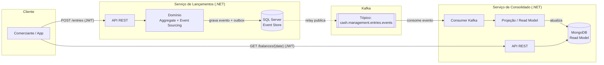
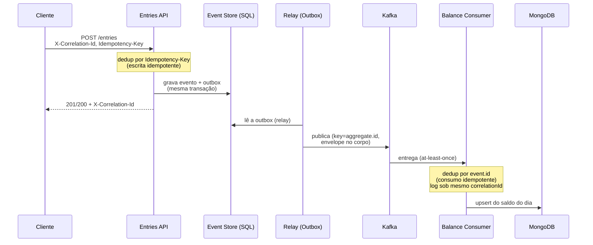
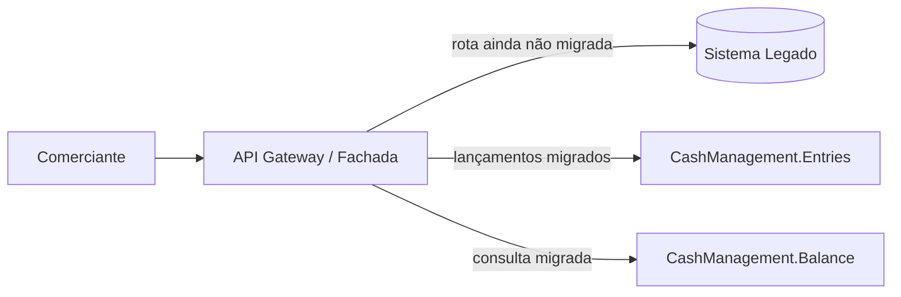

 # Design Doc — Arquitetura da Solução de Controle de Caixa Diário


|                         |                                                                                                                                                     |
| ----------------------- | --------------------------------------------------------------------------------------------------------------------------------------------------- |
| **Status**              | Proposto                                                                                                                                            |
| **Versão**              | 1.0.0 (ver Histórico de Revisões no fim do documento)                                                                                              |
| **Autor**               | Rafael Pinho                                                                                                                                        |
| **Data**                | 2026-06-25                                                                                                                                          |
| **Ferramenta de apoio** | Claude (Anthropic), usado como copiloto na redação deste documento e nas decisões de arquitetura; também apoiará a implementação do código. |

## Resumo Executivo

Solução de **controle de caixa diário** para um comerciante, composta por **dois
microsserviços independentes**:

- **Lançamentos** (`Entries`) — registra débitos/créditos com **Event Sourcing**
  (SQL Server como *event store*), garantindo integridade e auditabilidade.
- **Consolidado** (`Balance`) — projeta os eventos em um **read model**
  (MongoDB) e responde o saldo do dia.

Os dois se comunicam **de forma assíncrona via Kafka** (CQRS), com
**Transactional Outbox** garantindo publicação confiável. Esse desacoplamento
atende o RNF central — **Lançamentos continua disponível mesmo se o Consolidado
cair** — e o Consolidado escala de forma independente para absorver os picos de
leitura. Stack: **.NET 10 / C# 14**, sobe local com `docker-compose up`.

> Leitura sugerida: §1 (domínio) → §4 (arquitetura alvo) → §5 (decisões). As
> seções 1–12 abaixo detalham cada ponto.

## 1. Domínio de Negócio

O domínio desta solução é **Cash Management** (Gestão de Caixa): um
**comerciante controlando o fluxo de caixa do próprio negócio** — registrando
débitos e créditos (lançamentos) e consultando o saldo diário consolidado,
exatamente como descrito no problema de negócio.

Dentro desse domínio, identificamos dois subdomínios/bounded contexts:

- **Lançamentos** (`CashManagement.Entries`) — responsável por registrar
  cada movimentação financeira individual (débito ou crédito) de forma
  confiável e auditável.
- **Consolidado Diário** (`CashManagement.Balance`) — responsável por
  agregar os lançamentos de um dia e expor o saldo consolidado para
  consulta/relatório.

Cada subdomínio é implementado como um **serviço independente**, com ciclo de
vida, deploy e escalonamento próprios — permitindo que o Consolidado escale,
falhe ou seja reiniciado sem nunca impactar a disponibilidade de Lançamentos.

### 1.1 Organização do repositório

A solução adota um **monorepo com duas solutions independentes** — um único
repositório Git, mas cada serviço com sua própria `.sln`, sem
`ProjectReference` cruzado entre eles:

```
cash-management/
├── docs/
├── docker-compose.yml
└── src/
    ├── CashManagement.Entries/
    │   ├── CashManagement.Entries.sln
    │   ├── CashManagement.Entries.Domain/
    │   ├── CashManagement.Entries.Application/
    │   ├── CashManagement.Entries.Infrastructure/
    │   ├── CashManagement.Entries.Api/
    │   └── tests/
    └── CashManagement.Balance/
        ├── CashManagement.Balance.sln
        ├── CashManagement.Balance.Application/
        ├── CashManagement.Balance.Infrastructure/
        ├── CashManagement.Balance.Api/
        └── tests/
```

Essa escolha equilibra dois interesses: um monorepo facilita a operação
(um clone, um `docker-compose up` sobe tudo, um único histórico de
commits), enquanto solutions separadas evitam a tentação de referenciar
projetos um do outro diretamente — o que reintroduziria, no nível de build, o
acoplamento que a arquitetura de microsserviços desacoplados via Kafka foi
desenhada para evitar.

### 1.2 Organização interna de cada serviço

Os dois serviços usam **Clean Architecture**, mas com profundidade diferente,
refletindo a natureza de cada um:

- **`CashManagement.Entries`** usa Clean Architecture completa (4 camadas:
  Domain, Application, Infrastructure, Api), porque concentra a lógica de
  negócio real do domínio — agregados, invariantes e eventos do Event
  Sourcing precisam de uma camada de Domain isolada e protegida de
  dependências externas.
- **`CashManagement.Balance`** usa uma versão simplificada (3 camadas:
  Application, Infrastructure, Api), sem uma camada de Domain separada. Esse
  serviço não tem regras de negócio próprias a proteger — ele projeta eventos
  já validados pelo Entries em um read model. Manter uma camada de Domain
  vazia apenas para espelhar o outro serviço seria estrutura sem propósito.

Detalhes de cada estrutura estão documentados no `README.md` de cada serviço
(`/src/CashManagement.Entries/README.md` e
`/src/CashManagement.Balance/README.md`).

### 1.3 Linguagem Ubíqua (Ubiquitous Language) e Convenções de Nomenclatura

Todo o código (classes, métodos, namespaces) é escrito em **inglês**, de forma
consistente. Isso evita a mistura de idiomas que ocorre quando termos do
negócio (em português) são traduzidos de forma inconsistente ao
longo do código. A tabela abaixo fixa o vocabulário oficial do domínio —
o termo em português do negócio, e seu equivalente em inglês a ser
usado em código, documentação técnica e nomes de eventos/comandos:


| Termo de negócio (PT)             | Termo em código (EN) |
| ---------------------------------- | --------------------- |
| Lançamento                        | Entry                 |
| Débito                            | Debit                 |
| Crédito                           | Credit                |
| Consolidado Diário / Saldo do dia | Daily Balance         |
| Comerciante                        | Merchant              |
| Estorno / Cancelamento             | Reversal              |

Esse mapeamento é a "fonte da verdade" para nomear qualquer novo conceito que
surja no domínio — qualquer termo novo deve primeiro ser definido em português
(linguagem do negócio) e só então ganhar seu equivalente em inglês nesta
tabela, antes de entrar no código.

#### Commands — imperativo (uma intenção, pode ser rejeitada)

Commands representam uma intenção de ação, vivem em
`CashManagement.Entries.Application/Commands/`, e são nomeados no
**imperativo**, pois ainda não aconteceram e podem ser rejeitados pelo
Aggregate (ex: dados inválidos, ou estorno de um lançamento já estornado):

```
[Verbo][Objeto]Command
```


| Command               | Significado                           |
| --------------------- | ------------------------------------- |
| `PostCreditCommand`   | Intenção de registrar um crédito   |
| `PostDebitCommand`    | Intenção de registrar um débito    |
| `ReverseEntryCommand` | Intenção de estornar um lançamento |

#### Events — passado (um fato consumado, imutável)

Events representam um fato que **já aconteceu** e não pode ser desfeito —
apenas compensado por um novo evento (ex: um estorno). Vivem em
`CashManagement.Entries.Domain/Events/`, e são nomeados no **particípio
passado**:

```
[Objeto][ParticípioPassado]Event
```


| Event                | Significado                            |
| -------------------- | -------------------------------------- |
| `CreditPostedEvent`  | Um crédito foi registrado com sucesso |
| `DebitPostedEvent`   | Um débito foi registrado com sucesso  |
| `EntryReversedEvent` | Um lançamento foi estornado           |

> **Por que não nomear no imperativo (ex: `PostCreditEvent`)?** Um Event é
> consumido por outros serviços (no nosso caso, `CashManagement.Balance` via
> Kafka) como um registro do que já ocorreu, não como uma ordem para executar
> algo. Nomear no imperativo cria ambiguidade entre "isto é uma instrução" e
> "isto é um fato" — o que pode levar um consumidor a tratar o evento como uma
> ação a ser executada, em vez de um estado a ser refletido.

#### Aggregates e Value Objects


| Tipo                   | Convenção                            | Exemplo              |
| ---------------------- | -------------------------------------- | -------------------- |
| Aggregate Root         | `[Conceito]` (substantivo, sem sufixo) | `Entry`              |
| Value Object           | `[Conceito]` (substantivo, sem sufixo) | `Money`, `EntryType` |
| Repository (interface) | `I[Aggregate]Repository`               | `IEntryRepository`   |

#### Tópicos Kafka

Nomes de tópico seguem o padrão hierárquico `{domain}.{entity}.{content}`,
usando `.` como separador único (nunca misturado com `-` ou `_` no mesmo
nome, pois o Kafka trata esses caracteres de forma especial internamente):

```
{domain}.{entity}.events
```


| Tópico                          | Conteúdo                                                                                                 |
| -------------------------------- | --------------------------------------------------------------------------------------------------------- |
| `cash.management.entries.events` | Todos os eventos do agregado`Entry` (`CreditPostedEvent`, `DebitPostedEvent`, `EntryReversedEvent`, etc.) |

Optamos por **um único tópico por agregado** (em vez de um tópico por tipo de
evento) porque isso preserva a ordem de publicação entre eventos do mesmo
agregado — essencial em Event Sourcing, onde a ordem entre, por exemplo, um
crédito e um estorno subsequente do mesmo lançamento precisa ser garantida. O
tipo específico do evento é identificado por um campo (`event.type`) dentro da
própria mensagem, não pelo nome do tópico.

> Se a solução evoluir para múltiplos domínios consumidos por times externos,
> um prefixo de visibilidade (ex: `internal.cash.management.entries.events`)
> pode ser adotado para deixar explícito o escopo de consumo — não foi
> necessário nesta versão, por haver um único domínio e dois serviços já
> conhecidos.

#### Resumo da relação Command → Aggregate → Event

```
PostCreditCommand  ──▶  Entry (Aggregate)  ──▶  CreditPostedEvent
     (intenção)              (valida)              (fato consumado)
```

### 1.4 Capacidades de Negócio e Classificação dos Subdomínios

Antes de desenhar a solução, vale mapear **o que o negócio precisa saber fazer**
(capacidades) e **quanto cada subdomínio é estratégico** — isso orienta onde
concentrar esforço de modelagem (DDD estratégico).

#### Classificação dos subdomínios


| Subdomínio                | Tipo           | Por quê                                                                                                                                                                         |
| -------------------------- | -------------- | -------------------------------------------------------------------------------------------------------------------------------------------------------------------------------- |
| **Lançamentos** (Entries) | **Core**       | É a razão de ser do sistema: registrar dinheiro com integridade e auditabilidade. Concentra a modelagem rica (Event Sourcing, invariantes) — é onde está o valor e o risco. |
| **Consolidado** (Balance)  | **Supporting** | Entrega valor real (o relatório de saldo), mas é**derivado**: uma projeção dos eventos do core, sem regra de negócio própria complexa.                                     |
| **Identidade/Acesso**      | **Generic**    | Necessária (autenticação JWT), mas resolvida com padrão de mercado; não diferencia o negócio. Candidata natural a um IdP externo.                                          |

A cadeia de valor segue essa ordem: **registrar** movimentações (core) →
**consolidar** em saldo diário (supporting) → **consultar** o saldo (entrega de
valor ao comerciante), com **acesso autenticado** (generic) atravessando tudo.

#### Mapa de capacidades de negócio

Cada capacidade é uma habilidade que o negócio precisa ter, independente de
tecnologia — e abaixo, a que subdomínio pertence e como é realizada:


| Capacidade de negócio                                | Subdomínio       | Como é realizada                                                              |
| ----------------------------------------------------- | ----------------- | ------------------------------------------------------------------------------ |
| Registrar um crédito                                 | Lançamentos      | `POST /entries` → `PostCreditCommand` → `CreditPostedEvent`                  |
| Registrar um débito                                  | Lançamentos      | `POST /entries` → `PostDebitCommand` → `DebitPostedEvent`                    |
| Estornar um lançamento                               | Lançamentos      | `ReverseEntryCommand` → `EntryReversedEvent` (compensação, nunca exclusão) |
| Garantir registro confiável (sem perda/duplicação) | Lançamentos      | Event Sourcing + idempotência de escrita (`Idempotency-Key`)                  |
| Manter trilha de auditoria                            | Lançamentos      | Histórico imutável de eventos (append-only)                                  |
| Consolidar o saldo diário                            | Consolidado       | Projeção dos eventos em read model por data                                  |
| Consultar o saldo de um dia                           | Consolidado       | `GET /balances/{date}`                                                         |
| Autenticar o comerciante                              | Identidade/Acesso | JWT (Bearer token)                                                             |
| Rastrear uma operação ponta-a-ponta                 | Transversal       | `correlationId` (seção 4.3)                                                  |

## 2. Contexto e Problema de Negócio

Um comerciante precisa controlar seu fluxo de caixa diário, registrando débitos e
créditos (lançamentos), e necessita de um relatório consolidado com o saldo
diário disponível para consulta.

A partir desse problema, e do domínio definido acima, cada subdomínio assume
um papel distinto: Lançamentos registra cada movimentação; Consolidado agrega
essas movimentações em um saldo diário consultável.

Embora relacionados, esses subdomínios têm características operacionais
diferentes: o primeiro é **write-heavy** e exige forte garantia de integridade
transacional (é dinheiro — não pode perder, duplicar ou gravar fora de ordem);
o segundo é **read-heavy**, voltado a consulta agregada e tolerante a uma
pequena janela de defasagem (eventual consistency). Essa diferença orienta
praticamente todas as decisões de arquitetura abaixo.

## 3. Requisitos

> **Premissas de escopo (decisões conscientes):** a solução atende **um único
> comerciante** (*single-tenant*), opera em **uma única moeda — BRL**, e o
> **"dia" do saldo é definido no timezone de negócio `America/Sao_Paulo`**
> (eventos guardam `occurredAt` em **UTC**; a projeção converte para o dia local
> ao agregar). Multi-tenant e multi-moeda são evoluções naturais (§11), mas ficam
> fora do escopo desta versão para manter o foco no problema central.

### 3.1 Requisitos funcionais

O problema descreve o negócio em duas linhas — "um serviço de controle de
lançamentos" e "um serviço de consolidado diário". **Refinando** essas duas
frases nas capacidades concretas que elas implicam (ver mapa em §1.4), chegamos
aos requisitos funcionais abaixo:

**Lançamentos (Entries)**


| ID    | Requisito funcional                                                                              |
| ----- | ------------------------------------------------------------------------------------------------ |
| RF-01 | Registrar um **crédito** (valor em BRL, data/hora, identificação).                             |
| RF-02 | Registrar um **débito**.                                                                       |
| RF-03 | **Estornar** um lançamento existente, por compensação (nunca exclusão física).              |
| RF-04 | Garantir **idempotência de escrita**: um *retry* da mesma operação não duplica o lançamento. |
| RF-05 | Manter **histórico imutável e auditável** de cada movimentação.                              |
| RF-06 | **Publicar** cada lançamento como evento, para consumo do Consolidado.                          |

**Consolidado (Balance)**


| ID    | Requisito funcional                                                                     |
| ----- | --------------------------------------------------------------------------------------- |
| RF-07 | **Consumir** os eventos de lançamento de forma assíncrona.                            |
| RF-08 | Manter o **saldo consolidado por dia** (total de créditos, débitos e saldo).           |
| RF-09 | **Expor consulta** do saldo consolidado de uma data.                                    |
| RF-10 | Processar eventos de forma **idempotente** (não contar o mesmo lançamento duas vezes). |

**Transversais**


| ID    | Requisito funcional                                                            |
| ----- | ------------------------------------------------------------------------------ |
| RF-11 | **Autenticar/autorizar** as requisições externas (JWT).                      |
| RF-12 | Permitir **rastreabilidade ponta-a-ponta** de uma operação (`correlationId`). |

### 3.2 Requisitos não funcionais

Os dois RNF explícitos nos requisitos são **RNF-01** e **RNF-02**; os demais são
**derivados** da natureza do problema (é dinheiro, é distribuído, é exposto
externamente) e tornados explícitos aqui como parte do refinamento:


| ID         | Requisito não funcional                                    | Meta / critério                                                                                                                                    |
| ---------- | ----------------------------------------------------------- | --------------------------------------------------------------------------------------------------------------------------------------------------- |
| **RNF-01** | Lançamentos disponível mesmo com o Consolidado fora do ar | Zero dependência síncrona de Lançamentos em relação ao Consolidado; falha do Consolidado não degrada Lançamentos.*(requisito explícito)* |
| **RNF-02** | Throughput e perda no Consolidado em pico                   | Sustentar**≥ 50 req/s** de leitura com **≤ 5%** de perda/erro. *(requisito explícito)*                                                        |
| RNF-03     | Integridade financeira em Lançamentos                      | 0 perda, 0 duplicação (idempotência), ordenação por agregado garantida.                                                                        |
| RNF-04     | Consolidação por eventual consistency                     | Defasagem típica entre o lançamento e seu reflexo no saldo na ordem de**segundos** (aceitável para o relatório diário).                        |
| RNF-05     | Segurança de acesso                                        | 100% dos endpoints externos sob autenticação JWT.                                                                                                 |
| RNF-06     | Observabilidade / rastreabilidade                           | Toda requisição correlacionável ponta-a-ponta entre os dois serviços.                                                                           |

Lidos juntos, **RNF-01** e **RNF-02** indicam que os serviços precisam de
**isolamento de falha** entre si — uma falha ou degradação no Consolidado não
pode se propagar para Lançamentos. Isso descarta, de partida, qualquer
acoplamento síncrono direto entre os dois (ex: Lançamentos chamando o
Consolidado via HTTP de forma bloqueante).

> **Dimensionamento — nota sobre os 50 req/s:** para um *read model* dedicado em
> MongoDB respondendo a uma consulta simples por data, 50 req/s é uma carga
> **modesta**, bem dentro do que uma única instância atende com folga. O número
> não pressiona a arquitetura; o que ele sinaliza é a necessidade de o
> Consolidado **escalar de forma independente** de Lançamentos (o que o CQRS já
> garante) — e a tolerância de 5% de perda dá margem para *deploys*,
> *rebalanceamentos* e janelas de indisponibilidade curta sem violar o RNF.

## 4. Arquitetura Alvo

### 4.1 Visão geral



### 4.2 Fluxo principal

1. O comerciante envia um lançamento (débito ou crédito) via `POST /entries`
   autenticado ao serviço de **Lançamentos** (`CashManagement.Entries`).
2. O serviço valida a requisição, cria o evento correspondente (ex:
   `CreditPostedEvent`, `DebitPostedEvent`) e o grava append-only no
   **SQL Server** (*event store*) **junto com um registro na tabela `outbox`, na
   mesma transação** (Transactional Outbox — §5.9).
3. Um *relay* lê a `outbox` e publica o evento no tópico Kafka
   `cash.management.entries.events` (com retry). Como gravar e enfileirar são
   **atômicos**, nenhum evento gravado deixa de ser publicado.
4. O serviço de **Consolidado** (`CashManagement.Balance`) consome o evento de
   forma assíncrona, atualiza sua projeção (saldo agregado do dia) e persiste
   o resultado no **MongoDB**.
5. O comerciante consulta o saldo consolidado via `GET /balances/{date}`
   autenticado ao serviço de Consolidado, que responde diretamente a partir da
   sua projeção em MongoDB — sem nunca consultar Lançamentos em tempo real.

Se o Consolidado estiver indisponível, o Kafka retém os eventos publicados;
Lançamentos continua operando normalmente, pois sua responsabilidade termina ao
publicar o evento. Quando o Consolidado voltar, ele retoma o consumo do ponto
onde parou.

> **Retenção e fonte da verdade:** o **event store SQL é a fonte da verdade**; o
> Kafka é apenas o **transporte**. Por isso a retenção do tópico pode ser finita
> — adotamos **7 dias**, suficiente para o Consolidado se recuperar de uma
> indisponibilidade prolongada. Numa interrupção maior que a retenção, a
> projeção pode ser **reconstruída por replay** a partir do event store.

### 4.3 Identificadores, Idempotência e Rastreabilidade

Em um fluxo assíncrono e distribuído (REST → Event Store → Kafka → projeção),
quatro identificadores diferentes garantem **rastreabilidade ponta-a-ponta**,
**ordenação** e **processamento idempotente**. Cada um resolve um problema
distinto e atua em uma camada diferente — tratá-los como se fossem um só (ex:
reaproveitar o mesmo id para tudo) quebra garantias importantes. A tabela
abaixo resume os quatro; as subseções detalham cada um.


| Identificador    | O que identifica                                                                              | Onde trafega                                                                                 | Quem gera                                                                    |
| ---------------- | --------------------------------------------------------------------------------------------- | -------------------------------------------------------------------------------------------- | ---------------------------------------------------------------------------- |
| `correlationId`  | Uma requisição de negócio ponta-a-ponta (todo o fluxo que ela dispara, cruzando serviços) | Header HTTP`X-Correlation-Id`; no corpo do evento publicado no Kafka; nos logs               | Borda (API do Entries) — gera se o cliente não enviar; respeita se enviado |
| `idempotencyKey` | Uma tentativa lógica de comando do cliente (para deduplicar*retries*)                        | Header HTTP`Idempotency-Key`                                                                 | Cliente (comerciante / app)                                                  |
| `aggregateId`    | A instância do agregado`Entry` (o *stream* de eventos)                                       | Corpo do evento (`aggregate.id`); também usado como **key/partition key** da mensagem Kafka | Entries, ao criar o agregado                                                 |
| `eventId`        | Um evento individual (fato imutável)                                                         | Corpo do evento (`event.id`)                                                                 | Entries, ao gerar o evento                                                   |

#### `correlationId` — rastreabilidade ponta-a-ponta

É o fio que costura uma operação de negócio ao longo de todo o seu percurso.
A API do Entries lê o header `X-Correlation-Id`: se o cliente enviou, ele é
respeitado (permite o cliente correlacionar do seu lado); se não, o serviço
gera um `UUID` na borda. Esse valor é então (a) ecoado na resposta HTTP, (b)
incluído em **toda linha de log** dos dois serviços e (c) carregado no **corpo**
do evento publicado no Kafka, de modo que o consumidor do Balance registre seus
logs sob o **mesmo** `correlationId`. O resultado é poder responder a "mostre
tudo o que aconteceu para esta requisição, nos dois serviços" com um único
filtro — base direta para a seção de Observabilidade.

#### `idempotencyKey` — idempotência na escrita

Clientes REST repetem requisições (timeout, retry de rede, duplo clique). Sem
deduplicação, um *retry* de `POST /entries` registraria o mesmo crédito/débito
duas vezes — inaceitável para dinheiro. O cliente envia um `Idempotency-Key`
estável por operação lógica; o Entries persiste as chaves já processadas (com
o resultado original) e, se a mesma chave chegar de novo dentro da janela de
deduplicação (**24h**), **não cria novo evento** — retorna o resultado da
primeira gravação. É distinto do `correlationId`: o `correlationId` pode variar entre
tentativas, enquanto o `idempotencyKey` precisa ser **estável** entre os
*retries* da mesma operação para que a deduplicação funcione.

#### `aggregateId` — ordenação por agregado

É o identificador do *stream* no Event Sourcing — a que instância de `Entry`
um evento pertence. Ele é usado como **partition key** do tópico Kafka, o que
faz todos os eventos de um mesmo agregado caírem na **mesma partição** e,
portanto, serem entregues **em ordem** (coerente com a decisão de "um tópico
por agregado" da seção 1.3 — ex.: um crédito e seu estorno subsequente nunca
chegam fora de ordem ao Balance). O controle de concorrência otimista do
agregado também se ancora nesse id + versão.

#### `eventId` — idempotência no consumo

O Kafka entrega **at-least-once**: o consumidor do Balance pode receber o mesmo
evento mais de uma vez (rebalanceamento de partição, *retry*, redeploy). Para
a projeção não contar o mesmo crédito duas vezes, o consumidor **deduplica por
`eventId`** — registra os `eventId` já processados (ou usa *upsert* idempotente
chaveado pelo `eventId`), tornando o reprocessamento do mesmo evento um *no-op*.
É isso que torna a projeção **efetivamente exactly-once** apesar da entrega
at-least-once — essencial para a correção do saldo consolidado.

#### Envelope da mensagem (contrato Kafka)

Cada mensagem publicada em `cash.management.entries.events` carrega um envelope
padronizado **no corpo** — única fonte da verdade. Optamos por **não espelhar**
os identificadores (`event.id`, `event.type`, `correlationId`, etc.) também nos
headers Kafka: manter o mesmo campo em dois lugares é redundante e abre espaço
para divergência entre corpo e header. O único metadado fora do corpo é a
**key** da mensagem, igual ao `aggregateId` — e isso não é duplicação, mas o
próprio mecanismo de particionamento do Kafka (é a key que define a partição e,
portanto, a ordem por agregado). Como o Balance consome **todos** os eventos do
tópico, ele desserializa o corpo de qualquer forma; não há ganho em filtrar por
header antes de desserializar:

Campos com prefixo comum são **agrupados em objetos** em vez de repetir o
prefixo em cada chave: o agrupamento já carrega o contexto, então `event.id` é
mais limpo que `eventId`, e `aggregate.version` que `aggregateVersion`.

```jsonc
// key da mensagem = aggregate.id  (define a partição → ordem por agregado)
{
  "event": {
    "id":      "uuid",                 // idempotência no consumo
    "type":    "CreditPostedEvent",    // ver convenção na seção 1.3
    "version": 1                       // versão do schema do evento
  },
  "aggregate": {
    "id":      "uuid",                 // stream do Entry
    "version": 7                       // concorrência otimista
  },
  "correlationId": "uuid",             // rastreabilidade ponta-a-ponta
  "initiatedBy":   "merchant-id",      // ator que originou (identidade do JWT) — auditoria
  "occurredAt":    "2026-06-25T23:00:00Z",
  "data":          { /* payload específico do evento */ }
}
```

O `initiatedBy` registra **quem** originou o lançamento (a identidade extraída do
JWT na borda), respondendo à pergunta de auditoria financeira *"quem fez o quê"*
— distinto do `correlationId` (que rastreia a requisição, não o ator).

#### Propagação ponta-a-ponta



### 4.4 Contrato de Resposta da API

Todas as respostas — sucesso **e** erro — usam um **envelope padronizado**, para
o cliente ter **uma forma única de parsing**. O campo `status` do envelope sempre
**espelha** o HTTP status (nunca `200 OK` com `"status": "error"`), e toda
resposta ecoa o `correlationId` (§4.3).

**Sucesso** (HTTP `200`/`201`):

```jsonc
{
  "status": "success",
  "result": { /* o recurso — ex.: { "id": "..." } ou { date, totalCredits, totalDebits, balance } */ },
  "correlationId": "uuid"
}
```

**Erro** (HTTP `400`/`401`/`404`/`409`…):

```jsonc
{
  "status": "error",
  "error": {
    "code":    "ENTRY_ALREADY_REVERSED",
    "message": "Entry already reversed.",
    "details": []                          // ex.: erros de validação por campo
  },
  "correlationId": "uuid"
}
```

| HTTP Status | Quando | `error.code` (ex.) |
|---|---|---|
| `201 Created` | Lançamento registrado (+ `Location: /entries/{id}`) | — |
| `200 OK` | Consulta de saldo bem-sucedida | — |
| `400 Bad Request` | Validação ou regra de negócio (`ErrorType.Validation`) | `VALIDATION_FAILED` |
| `401 Unauthorized` | Token ausente/inválido | `UNAUTHORIZED` |
| `403 Forbidden` | Token sem o *scope* necessário | `INSUFFICIENT_SCOPE` |
| `404 Not Found` | Saldo/lançamento inexistente | `NOT_FOUND` |
| `409 Conflict` | Concorrência otimista ou estado inválido (`ErrorType.Conflict`) | `ENTRY_ALREADY_REVERSED` |
| `429 Too Many Requests` | *Rate limit* (§8.1) | `RATE_LIMITED` |

> **Trade-off consciente — envelope em vez de Problem Details (RFC 9457).** O
> padrão de mercado para erro é o `application/problem+json` (RFC 9457). Optamos
> pelo **envelope unificado** porque o requisito aqui é **uma forma só** para
> sucesso e erro (ergonomia do cliente) — algo que o Problem Details não cobre
> (ele só padroniza erro). É uma troca deliberada: abrimos mão do *media type*
> padrão em favor da consistência sucesso↔erro.

**Sem exceção como controle de fluxo (Result pattern).** Falhas **esperadas**
(validação, regra de negócio) **não lançam exceção**: o domínio e a aplicação
retornam um **`Result`** com um `Error` (`code`, `message`, `ErrorType`), e o
`ErrorType` mapeia para o HTTP status. Um **único filtro na borda** traduz
`Result` → envelope. Exceção fica reservada para o **inesperado** (falha de
infra, bug) — que vira `500` com o mesmo envelope. Detalhe do `Result` em §5.10.
As mensagens (`message`) são em **inglês** (linguagem ubíqua, §1.3), e os erros
são **sanitizados** (sem *stack trace*), conforme §8.1.

> **Convenção aqui, detalhe por endpoint no Swagger.** Esta seção fixa a
> **convenção** (o envelope e a semântica de cada status). Os códigos **possíveis
> por endpoint** vivem no **OpenAPI/Swagger gerado** (`[ProducesResponseType]`), a
> **fonte da verdade em runtime** — não duplicamos um mapa rota-a-rota aqui, para
> evitar *drift*.

## 5. Decisões de Arquitetura e Justificativas

### 5.1 Microsserviços (Lançamentos e Consolidado separados)

Os dois domínios têm perfis de carga, escalabilidade e criticidade diferentes.
Separar em serviços independentes permite que cada um escale e seja operado
de forma isolada, o que é exigido diretamente pelo requisito não funcional de
disponibilidade de Lançamentos independente do estado do Consolidado.

### 5.2 Comunicação assíncrona via Kafka

Uma chamada síncrona (ex: Lançamentos chamando Consolidado via REST a cada
lançamento) criaria acoplamento temporal: uma lentidão ou queda no Consolidado
afetaria diretamente a latência ou disponibilidade de Lançamentos. Usar Kafka
como intermediário desacopla os dois serviços no tempo: Lançamentos publica e
segue seu fluxo independentemente de o Consolidado estar disponível, íntegro
ou processando em outro ritmo.

Kafka foi escolhido (em vez de uma fila tradicional como RabbitMQ) por seu
modelo de log de eventos ordenado e persistente, que se alinha naturalmente ao
padrão de Event Sourcing adotado em Lançamentos, e por suportar replay e
múltiplos consumidores caso outros serviços precisem consumir os mesmos
eventos no futuro (ex: um serviço de auditoria).

### 5.3 Event Sourcing em Lançamentos

Cada lançamento é representado como um evento imutável
(`CreditPostedEvent`, `DebitPostedEvent`, etc. — ver convenção completa de
nomenclatura na seção 1.3), e o estado do agregado (`Entry`) é derivado da
sequência desses eventos. Para um domínio financeiro, isso traz auditabilidade
nativa (histórico completo e imutável de cada movimentação) e permite
reconstruir o estado em qualquer ponto do tempo.

Concorrência é controlada via **versionamento do Aggregate Root** (optimistic
concurrency control): cada novo evento gravado deve referenciar a versão
esperada do agregado, evitando gravações conflitantes.

### 5.4 CQRS entre Lançamentos e Consolidado

Lançamentos (lado de comando/escrita) e Consolidado (lado de consulta/leitura)
são modelados e armazenados de forma totalmente independente. O Consolidado
não é uma cópia do banco de Lançamentos — é uma **projeção** construída a
partir dos eventos, otimizada exclusivamente para a pergunta que ele precisa
responder bem e rápido: "qual o saldo consolidado do dia X".

### 5.5 SQL Server para Lançamentos

Lançamentos exige garantias fortes de integridade transacional: nenhum
lançamento pode ser perdido, duplicado, ou gravado fora de ordem. Um banco
relacional com suporte nativo a transações ACID oferece essas garantias de
forma nativa — append-only enforcement, ordenação garantida por agregado e
consistência transacional — sem que a aplicação precise reimplementar
manualmente mecanismos que o banco já resolve de fábrica.

**Trade-off considerado:** avaliamos usar MongoDB também em Lançamentos
(com aggregate root versionado fazendo o controle de concorrência). É
tecnicamente viável — o MongoDB suporta transações multi-documento desde a
versão 4.0 — mas o custo dessa abordagem é principalmente um **custo de
engenharia**, não de desempenho:

- O controle de concorrência via `version` no Aggregate Root não usa as
  transações ACID nativas do Mongo; é implementado na aplicação via
  optimistic concurrency (`updateOne` condicionado à versão esperada),
  exigindo lógica própria de retry/backoff quando há conflito.
- **Append-only não é garantido pelo banco** — depende de disciplina e/ou
  configuração manual de permissões para impedir update/delete em eventos já
  gravados. Em um event store relacional, essa é uma restrição estrutural do
  próprio motor.
- Ordenação garantida e auditável por stream, e replay nativo de eventos, são
  funcionalidades de primeira classe em um event store dedicado; no Mongo,
  precisariam ser construídas e mantidas manualmente.

Optamos por SQL Server porque, para um domínio financeiro, preferimos
garantias estruturais nativas do banco (ACID, ordenação, append-only) a
reconstruir essas garantias na camada de aplicação — reduzindo risco e esforço
de desenvolvimento/manutenção.

### 5.6 MongoDB para Consolidado

O Consolidado responde a um padrão de acesso bem definido: leitura de saldo
agregado por dia, sem necessidade de joins complexos ou transações
multi-entidade. Esse é o ponto forte de um banco de documentos: schema flexível,
leitura rápida de um documento já desnormalizado (ex: `{ date, totalCredits, totalDebits, balance }`), e bom desempenho sob carga de leitura — relevante para
absorver os picos de 50 req/s definidos no requisito não funcional.

### 5.7 REST/HTTP com JWT

Os dois serviços expõem APIs REST autenticadas via JWT (Bearer token) para o
consumo externo (comerciante). REST foi escolhido por ser o padrão mais
universal para exposição a clientes externos diversos (web, mobile, possíveis
integrações de terceiros), além de facilitar documentação (OpenAPI/Swagger) e
testes. gRPC foi considerado, mas traria complexidade adicional sem ganho
claro neste cenário, já que a comunicação interna de alta exigência de
desempenho (entre os serviços) já é resolvida via Kafka — não pela API
externa.

### 5.8 Building blocks de domínio próprios

O domínio de Lançamentos precisa de uma base de Event Sourcing — uma classe
`AggregateRoot` (aplicação e replay de eventos, rastreio de eventos
não-commitados, roteamento), uma base `DomainEvent`, contratos de
command/handler e fixtures de teste. Em vez de depender de um framework externo,
**implementamos essa base mínima dentro do próprio projeto**, sob medida para o
escopo da solução.

A abordagem segue **padrões consolidados** de DDD/Event Sourcing (agregado
event-sourced, testes no estilo Given/When/Then), com código **próprio e
enxuto** — sem dependência de NuGet externo, mantendo a solução autocontida e
auditável por quem for mantê-la.


| Abstração (própria)              | Papel no Entries                                                                                        |
| ----------------------------------- | ------------------------------------------------------------------------------------------------------- |
| `AggregateRoot`                     | Base do`Entry`: roteamento de eventos, `Apply`/replay, `Emit`, lista de eventos não-commitados         |
| `DomainEvent`                       | Base dos eventos (`CreditPostedEvent`, etc.), carregando o `aggregateId`                                |
| `ICommand` / `ICommandHandler<T>`   | Contrato e despacho dos commands                                                                        |
| `IEntryRepository` + event store    | Persistência e replay do agregado (implementação no Infrastructure, sobre o SQL Server)              |
| `ValueObject`                       | Value Objects (ex.:`Money`, `EntryType`) — imutáveis, igualdade por valor                            |
| `Result<T>` / `Error`               | Resultado de operação (sucesso/falha) sem exceção; `Error` carrega `code` + `message` + `ErrorType` (→ HTTP) |
| Fixtures de teste                   | Given/When/Then sobre o agregado e os handlers (ver seção 6)                                          |

Essas abstrações vivem em uma pasta de *seed work* no
`CashManagement.Entries.Domain` (núcleo do domínio, sem dependências externas), e
as fixtures, no projeto de testes.

**Por quê código próprio em vez de um framework:** mantém o repositório
autossuficiente (roda-se tudo sem buscar pacote privado), dá controle
total sobre abstrações pequenas e específicas do problema, e evita carregar
"encanação" genérica que este escopo não usa. O reuso vem do **padrão**
(comprovado), não de uma dependência binária — coerente com o pilar de
**soluções reutilizáveis**.

**Escopo:** essa base sustenta o lado rico (Entries). O Consolidado (Balance),
por ser um projetor sem domínio próprio (seção 1.2), não precisa dela.

**Concorrência:** o controle de versão otimista (*expected version*) por *stream*
fica na implementação do repositório/event store sobre o SQL Server
(seções 5.3 e 5.5), não no `AggregateRoot` em si.

**Trade-off:** é preciso escrever (e testar) essa base mínima — mas é pouco
código, e a independência + clareza compensam no contexto de avaliação.

### 5.9 Transactional Outbox (publicação confiável)

Gravar o evento no SQL e publicá-lo no Kafka são **dois recursos diferentes** —
não há transação distribuída entre eles. Publicar "depois do commit" é um
**dual-write**: se o processo cair entre o commit no SQL e o publish no Kafka, o
evento existe no event store mas **nunca chega** ao Balance (saldo fica errado,
em silêncio).

O **Transactional Outbox** elimina esse risco:

1. Na **mesma transação** do event store, o evento também é gravado numa tabela
   `outbox`. Ou ambos persistem, ou nenhum — atômico.
2. Um **relay** (processo/worker) lê a `outbox` e publica no Kafka, marcando
   cada registro como publicado. Em falha, **reenvia** (at-least-once).

> **Outbox × Unit of Work — não são a mesma coisa.** O **Unit of Work** é o
> mecanismo de transação atômica ("tudo ou nada"); o **Outbox** é o *uso* dessa
> atomicidade para publicar de forma confiável. O UoW é o que torna o passo 1
> atômico — sem ele, não há Outbox correto. Na prática, o `SaveAsync` do
> `IEntryRepository` abre uma Unit of Work, grava os eventos do agregado **e** a
> linha de `outbox` na mesma transação, e dá commit; o relay cuida do resto.

Isso garante **"gravou ⇒ será publicado"**, e casa com a outra ponta: o
consumidor do Balance já deduplica por `event.id` (§4.3), então o reenvio do
relay é inofensivo. Resultado: entrega confiável fim a fim, sem transação
distribuída.

> Alternativa considerada: **CDC** (ex.: Debezium lendo o log do SQL) entrega o
> mesmo efeito sem a tabela `outbox`, mas adiciona um componente de
> infraestrutura. Para o escopo, o outbox aplicativo é mais simples e
> autocontido; o CDC fica como evolução se o volume justificar.

### 5.10 Modelo de Domínio e Padrões de Implementação (Entries)

O agregado `Entry` é **event-sourced**: não guarda estado mutável direto — seu
estado é **derivado da sequência de eventos**. O comportamento valida
invariantes e **emite** eventos; os eventos (e só eles) mutam o estado, via
registro explícito `On<TEvent>()` (sem *reflection*). Invariantes que falham
retornam `Result.Fail(Error)` — **não lançam exceção** (ver abaixo). Sketches de
código no [README do Entries](../src/CashManagement.Entries/README.md).

**Mapa de padrões — usados porque resolvem algo (não por enfeite):**

| Padrão | Onde | Por quê |
|---|---|---|
| **Command** (GoF) | `PostCreditCommand` + handler | Encapsula a intenção; pode ser validada/rejeitada antes de virar fato |
| **Mediator** (GoF) | `CommandDispatcher` próprio (enxuto) | Desacopla emissor do handler, **captura o comando e devolve resultado** (`Send<TResult>`); ponto único para *cross-cutting* (log, validação, idempotência) |
| **Repository** (DDD) | `IEntryRepository` | Abstrai o event store; o domínio não sabe que é SQL |
| **Factory** (GoF) | `Entry.PostCredit(...)` e a reconstrução por replay | Criação consistente já emitindo o evento |
| **Domain Event** (DDD) | os `*Event` | Base do Event Sourcing e da integração via Kafka |
| **Value Object** (DDD) | `Money`, `EntryType` | Igualdade por valor; evita *primitive obsession* |
| **Result / Railway-Oriented** | `Result<T>` + `Error` | Falha esperada **sem exceção**; compõe e mapeia direto no envelope (§4.4) |
| **Template Method** (GoF) | `AggregateRoot` define o esqueleto do replay | A subclasse só registra os `On<>` |
| **Memento** (GoF) | *snapshot* de agregado | **Não agora** — evolução (§11), para evitar replay longo |

**Deliberadamente fora** (anti over-engineering): *Visitor* para eventos (o
`On<>` resolve), *Specification* para validação (as regras são simples),
biblioteca de mediator (um dispatcher próprio de poucas linhas basta — também
evitando a licença comercial das versões novas do MediatR).

**SOLID na prática:**

- **SRP:** o handler orquestra, o agregado protege invariantes, o repositório
  persiste, a projeção projeta — quatro responsabilidades, quatro lugares.
- **OCP:** um novo tipo de evento entra com um novo `On<>` e seu handler, sem
  tocar na mecânica de replay.
- **DIP:** o Domain define `IEntryRepository`/`IEventPublisher`; a Infrastructure
  implementa — exatamente a regra de dependência da Clean Architecture (§1.2).

**Tratamento de falhas — `Result`, sem exceção:** falhas **esperadas** (regra de
negócio, validação) retornam um `Result` com `Error` (`code`, `message`,
`ErrorType`), **sem lançar**. Ex.: `Entry.Reverse()` devolve
`Result.Fail(new Error("ENTRY_ALREADY_REVERSED", "...", ErrorType.Conflict))` em
vez de uma exceção. Isso percorre handler → dispatcher (`Result<T>`) até um
**filtro na borda** que traduz `Result` → envelope + HTTP status (§4.4). Exceção
fica só para o **inesperado** (infra/bug → `500`). É a evolução consciente do
antigo `BusinessException` (exceção carregando `HttpStatusCode`): o `ErrorType`
cumpre o mesmo papel de definir o status, **sem** usar exceção como controle de
fluxo.

**Identidade e retorno do comando:** o `aggregateId` é um `Guid` **gerado na
camada de aplicação** (no handler), nunca pelo banco — ele é o *stream id* e a
*partition key*, então precisa existir **antes** de persistir. O
`CommandDispatcher` **devolve esse id** num `Result<Guid>` (`Send<TResult>`): uma criação retorna o
**id** (não o agregado — não se vaza o *write model*; quem quer o estado
completo consulta o read side). Num *retry* com a mesma `Idempotency-Key`, o id
devolvido é o **original** — a deduplicação é um *behavior* em volta do `Send`,
não lógica espalhada no handler.

A **concorrência otimista** (`aggregate.version`) é verificada na gravação do
repositório (expected version), não no agregado em si (§5.8).

## 6. Estratégia de Testes (TDD)

A solução é desenvolvida com **TDD** (Red → Green → Refactor), com ênfase no
domínio de **Lançamentos**, onde se concentram as regras de negócio. Os testes
são a **especificação executável** dessas regras: cada invariante é escrita como
um teste **antes** da implementação.

### 6.1 Níveis de teste


| Nível              | O que cobre                                                                                                                   | Ferramentas                                 |
| ------------------- | ----------------------------------------------------------------------------------------------------------------------------- | ------------------------------------------- |
| Unit — Domínio    | Comportamento do agregado`Entry`: cada ação produz os eventos certos ou rejeita com o `Result`/erro certo. Rápido, sem infra.  | `AggregateTestFixture` (própria), xUnit    |
| Unit — Application | Command handlers: orquestração com dependências automockadas. Assere`PublishedEvents` ou o `Result` retornado.                | `CommandTestFixture` (própria), Moq        |
| Integração        | API + infra real: persistência no event store (SQL), publish no Kafka, consumo e projeção no Mongo. Round-trip de verdade. | Testcontainers (SQL Server, Kafka, MongoDB) |
| Contrato            | O envelope Kafka (§4.3): produtor (Entries) e consumidor (Balance) concordam no schema. Impede*drift* de contrato.           | Testes de schema sobre o envelope           |
| Carga               | Valida o RNF do Consolidado: 50 req/s com ≤ 5% de perda no`GET /balances/{date}`.                                            | k6 / NBomber                                |

### 6.2 TDD do domínio com Given/When/Then

O ciclo mapeia direto nas nossas fixtures: `Given()` = histórico de eventos do
agregado; `When()` = a ação sob teste; **Then** = asserção sobre os eventos
emitidos (`PublishedEvents`) ou o **`Result`** retornado (sucesso/falha).

Exemplo — a regra *"um lançamento já estornado não pode ser estornado de novo"*,
escrita **antes** de implementar o `Entry.Reverse()`:

```csharp
public class When_reversing_an_already_reversed_entry
    : AggregateTestFixture<Entry>
{
    private readonly Guid _id = Guid.NewGuid();

    // histórico: crédito lançado e já estornado
    protected override IEnumerable<IDomainEvent> Given() => new IDomainEvent[]
    {
        new CreditPostedEvent(_id, Money.Of(100m, "BRL")),
        new EntryReversedEvent(_id),
    };

    // ação: tentar estornar de novo
    protected override Result When() => AggregateRoot.Reverse();

    [Fact]
    public void Then_it_is_rejected() =>
        Result.Error.Code.Should().Be("ENTRY_ALREADY_REVERSED");   // sem exceção
}
```

E o caminho feliz no nível de command handler (repositório e publisher
automockados pela própria fixture):

```csharp
public class When_posting_a_credit
    : CommandTestFixture<PostCreditCommand, PostCreditCommandHandler, Entry>
{
    protected override PostCreditCommand When() =>
        new PostCreditCommand(amount: 100m, occurredAt: DateTime.UtcNow);

    [Fact]
    public void Then_a_CreditPostedEvent_is_published() =>
        PublishedEvents.OfType<CreditPostedEvent>().ShouldHaveSingleItem();
}
```

> As asserções usam uma lib de legibilidade (ex.: Shouldly/FluentAssertions);
> o essencial é que a fixture já entrega `PublishedEvents` e o `Result`
> prontos para asserção.

### 6.3 Os pontos críticos têm teste dedicado

São as garantias que sustentam o *"é dinheiro"* — cada uma vira teste explícito,
mapeando os identificadores da seção 4.3:

- **Idempotência de escrita** (`Idempotency-Key`): integração — o mesmo
  `Idempotency-Key` enviado duas vezes em `POST /entries` ⇒ **um** único evento
  gravado/publicado.
- **Idempotência de consumo** (`event.id`): integração — o mesmo evento entregue
  duas vezes pelo Kafka ⇒ saldo contado **uma** vez (projeção *exactly-once*).
- **Concorrência otimista** (`aggregate.version`): integração — dois commands
  concorrentes no mesmo agregado ⇒ um vence, o outro falha/retry, sem gravação
  fora de ordem.
- **Ordenação por agregado**: contrato/integração — um crédito e seu estorno
  chegam ao Balance na ordem de publicação.

### 6.4 Lado de leitura (Balance)

Os handlers de projeção são testados como funções quase puras: dado um evento
(ou uma sequência), assere-se o documento `DailyBalance` resultante
(`{ date, totalCredits, totalDebits, balance }`). As consultas de leitura são
feitas direto sobre o read model no MongoDB (driver oficial).

### 6.5 Execução e CI

- **Unit** roda em todo push (rápido, sem infra); **integração** e **carga**
  rodam no pipeline de PR (dependências sobem via Testcontainers).
- Cobertura medida (ex.: coverlet), com foco em cobrir **regras de negócio** —
  não percentual por percentual.

## 7. Como os Requisitos Não Funcionais São Endereçados


| Requisito (§3.2)                                             | Como é endereçado                                                                                                                                                                                                                        |
| ------------------------------------------------------------- | ------------------------------------------------------------------------------------------------------------------------------------------------------------------------------------------------------------------------------------------ |
| **RNF-01** — Lançamentos não pode cair se Consolidado cair | Desacoplamento via Kafka: Lançamentos só publica eventos, não depende de resposta do Consolidado. Falha no Consolidado não bloqueia nem degrada Lançamentos.                                                                          |
| **RNF-02** — Consolidado: ≥50 req/s, ≤5% de perda em picos | MongoDB como read model dedicado a leitura, sem concorrer com a carga de escrita de Lançamentos; escala horizontalmente de forma independente (réplicas de leitura, mais instâncias do serviço). Ver nota de dimensionamento em §3.2. |
| **RNF-03** — Integridade financeira                          | Event Sourcing append-only + idempotência (`Idempotency-Key`/`event.id`) + concorrência otimista (`aggregate.version`).                                                                                                                  |
| **RNF-04** — Eventual consistency                            | Consolidação assíncrona via Kafka; defasagem de segundos, aceita conscientemente (§10).                                                                                                                                                |
| **RNF-05** — Segurança de acesso                            | Endpoints externos sob JWT (§5.7).                                                                                                                                                                                                        |
| **RNF-06** — Observabilidade                                 | `correlationId` propagado ponta-a-ponta (§4.3).                                                                                                                                                                                           |

As subseções abaixo consolidam os dois pilares que sustentam esses RNFs:
**resiliência** (por trás de RNF-01) e **escalabilidade** (por trás de RNF-02).

### 7.1 Resiliência

Projetada para **recuperar de falhas**, não para fingir que elas não ocorrem:

- **Isolamento de falha (RNF-01):** o desacoplamento via Kafka garante que a
  queda do Consolidado não se propaga para Lançamentos — não há acoplamento
  síncrono entre eles (§5.2).
- **Health checks (liveness/readiness):** cada serviço expõe endpoints de saúde
  que o orquestrador (Kubernetes / compose) usa para agir **automaticamente**:
  - **Liveness** (`/health/live`): se a instância travar, o orquestrador a
    **reinicia**.
  - **Readiness** (`/health/ready`): verifica as dependências (Entries: SQL
    Server + Kafka; Balance: MongoDB + Kafka). Enquanto não estiverem
    acessíveis, a instância é **tirada do balanceador** (não recebe tráfego) sem
    ser morta — evitando responder a uma requisição que iria falhar.
  - Implementados com os **HealthChecks nativos do ASP.NET Core**.
- **Recuperação automática do consumo:** o Kafka retém os eventos; ao voltar, o
  Balance **retoma do offset** onde parou (§4.2), e a idempotência (§4.3) torna
  o reprocessamento seguro.
- **Redundância e failover:** múltiplas instâncias por serviço atrás de
  balanceador; o **consumer group** do Kafka rebalanceia as partições se um
  consumidor cai; bancos em alta disponibilidade (ex.: SQL Server Always On,
  *replica set* do MongoDB).
- **Dead-letter queue** (evolução, §11): mensagens que falham repetidamente saem
  do fluxo principal, mantendo o consumidor saudável.
- **Retry com backoff** nas operações transitórias (publicação/consumo).

### 7.2 Escalabilidade

- **Escala independente por CQRS:** os lados de escrita (Entries) e leitura
  (Balance) escalam **separadamente**, cada um conforme sua carga — exatamente o
  que o RNF-02 pede (o Consolidado cresce sem tocar em Lançamentos).
- **Escala horizontal:** os serviços são **stateless** (o estado vive nos bancos
  e no Kafka), então escalar é **adicionar instâncias** atrás do balanceador.
- **Particionamento Kafka:** o throughput de consumo escala com o número de
  partições do tópico; somar consumidores ao *group* aumenta o paralelismo até o
  número de partições.
- **Read model elástico:** o MongoDB escala leitura via réplicas; e, como visto
  em §3.2, 50 req/s é carga **modesta** — há folga ampla.
- **Cache:** alavanca de latência/escala — detalhada na §7.3 (cache HTTP por
  padrão; Redis distribuído como alavanca quando a carga crescer).

### 7.3 Cache

> Cache aqui é **alavanca de latência/escala, não requisito**: 50 req/s é carga
> baixa (§3.2) e o read model em MongoDB já é uma projeção otimizada dos eventos.
> Por isso o **default é o cache HTTP barato**; o cache distribuído fica
> documentado e pronto, a ser ligado **por métrica**, não por suposição.

**Camada 1 — Cache HTTP no `GET /balances/{date}`** (por natureza do dado):

- **Dias passados** (dia fechado): saldo **estável**, mas **não imutável** — um
  *estorno tardio* pode alterar um dia já fechado. Por isso, `max-age` longo
  **porém limitado** + `ETag` (em vez de `immutable`); a correção real vem da
  invalidação event-driven da Camada 2, que derruba o cache da data quando chega
  um estorno.
- **Dia corrente** (volátil): `max-age` curto (ou `no-cache`) + `ETag` para
  revalidação barata (`304 Not Modified` quando nada mudou).

**Camada 2 — Cache de aplicação (alavanca): cache-aside distribuído (Redis)**

- **Distribuído** (não em memória), para ser **consistente entre múltiplas
  instâncias** do Balance.
- **Invalidação event-driven** (o ponto central): quando o consumer atualiza a
  projeção da data `D`, ele **invalida/reescreve** a entrada de cache de `D`.
  Como o Balance **já processa o evento**, a invalidação é **precisa** (o cache
  nunca fica mais velho que a projeção) e não exige orquestração extra.

**Reuso de componente:** o mesmo Redis pode hospedar o store de
`Idempotency-Key` do Entries (TTL = janela de dedup de 24h, §4.3) — um
componente, dois usos.

**Princípios:**

- Respeita a **eventual consistency** (RNF-04): TTL curto no dia corrente; o
  cache nunca mascara defasagem além da projeção.
- Invalidação **no momento do update** da projeção, não por TTL "no chute".
- **Não liga por padrão** — habilitar o Redis é decisão guiada por métrica
  (latência, taxa de acerto), evitando complexidade que os 50 req/s não exigem.

## 8. Requisitos Diferenciais

Os itens a seguir são **diferenciais** da solução. Esta seção os endereça
integralmente: segurança de integração (§8.1), observabilidade (§8.2),
estimativa de custos (§8.3) e arquitetura de transição (§8.4).

### 8.1 Segurança

A segurança é tratada em camadas (*defense in depth*), do acesso externo ao
canal de integração interna. Um ponto de atenção especial são os **critérios de
segurança para consumo (integração) de serviços** — e neste desenho a
integração entre os serviços **não é HTTP síncrono, e sim o canal Kafka**, então
é ele o foco principal abaixo.

#### Autenticação e autorização (acesso externo)

- **Autenticação:** as APIs externas (comerciante) exigem **JWT Bearer**. A
  emissão do token é responsabilidade de um **IdP** — o subdomínio de
  Identidade/Acesso, classificado como *Generic* em §1.4 e candidato a um
  provedor externo (ex.: Keycloak, Auth0, Entra ID). Os serviços apenas
  **validam** o token: assinatura, expiração, *issuer* e *audience*.
- **Autorização por escopo:** acesso de menor privilégio via *scopes* — ex.:
  `entries:write` para `POST /entries`, `balances:read` para
  `GET /balances/{date}`. (Isolamento por *tenant* não se aplica nesta versão
  *single-tenant* — ver premissas em §3 e evolução em §11.)

#### Segurança na integração entre serviços (foco do diferencial)

Como Entries e Balance se comunicam **só** via Kafka (não há chamada
serviço-a-serviço síncrona — decisão de §5.2), proteger a integração é proteger
o canal de eventos:


| Critério                            | Como                                                                                                                                                    |
| ------------------------------------ | ------------------------------------------------------------------------------------------------------------------------------------------------------- |
| **Criptografia em trânsito**        | TLS entre produtores/consumidores e os*brokers* Kafka.                                                                                                  |
| **Autenticação de serviço**       | SASL (ex.: SCRAM) ou**mTLS** — só serviços autenticados produzem/consomem.                                                                           |
| **Autorização por tópico (ACLs)** | Menor privilégio: Entries**só produz** em `cash.management.entries.events`; Balance **só consome**. Nenhum dos dois tem acesso além do necessário. |
| **Contrato validado**                | O envelope (§4.3) é verificado por testes de contrato (§6.1), evitando que mensagens malformadas quebrem o consumidor.                               |

> A própria ausência de acoplamento síncrono é um ganho de segurança: reduz a
> superfície de ataque *east-west* e o raio de impacto de um serviço
> comprometido — ele não consegue chamar o outro diretamente.

#### Criptografia e gestão de segredos

- **Em trânsito:** TLS fim a fim — cliente↔API (HTTPS), serviço↔Kafka,
  serviço↔banco.
- **Em repouso:** criptografia no nível do banco (TDE no SQL Server, *encryption
  at rest* no MongoDB).
- **Segredos:** nunca no código ou no repositório (o `.gitignore` já exclui
  `.env`); injetados por variável de ambiente / *secret manager* (ex.: Vault,
  KMS da nuvem).

#### Proteção contra abusos e ataques

- **Validação de entrada:** comandos validados na camada de Application
  (`Validators/`); entrada inválida vira um `Result` com `ErrorType.Validation`
  → `400` (§4.4), **sem exceção** e sem chegar ao domínio.
- **Rate limiting / *throttling*:** no *gateway*/API, protege contra abuso e
  ajuda a manter o envelope de 50 req/s (RNF-02).
- **Idempotência como defesa:** o `Idempotency-Key` (§4.3) também mitiga
  submissões duplicadas (acidentais ou maliciosas).
- **Erros sem vazamento:** respostas de erro sanitizadas (sem *stack trace* nem
  detalhes internos) por um filtro de exceção global.
- **Trilha de auditoria nativa:** o Event Sourcing dá um histórico imutável e
  *tamper-evident* de toda movimentação — relevante para um domínio financeiro.

### 8.2 Observabilidade e Monitoramento

Em um fluxo assíncrono e distribuído (REST → Event Store → Kafka → projeção),
observabilidade não é luxo: é o que permite responder "onde está esta operação?"
e "o Consolidado está acompanhando o ritmo?". A base já foi lançada na §4.3 (o
`correlationId` propagado ponta-a-ponta); aqui ela vira os três pilares.

#### Logs

- **Estruturados** (JSON via Serilog), com o `correlationId` em **toda linha**
  dos dois serviços — permitindo, com um único filtro, ver tudo o que uma
  requisição disparou **cruzando os dois serviços**.
- Centralizados em uma stack de logs para busca e correlação (local:
  **OpenSearch**; alternativas: Seq, Loki, ELK).

**Campos estruturados, não tags na string.** O componente de origem é um
**campo** (`component`), não um prefixo `[Consumer:...]` embutido na mensagem —
assim o OpenSearch filtra por `component: "KafkaConsumer"` em vez de *grep* de
texto. No console de dev, um *output template* ainda pode renderizar
`[KafkaConsumer:BalanceProjectionConsumer]` para leitura humana.

| Campo | Sempre? | Exemplo |
|---|---|---|
| `@timestamp` (UTC), `level`, `message` | ✅ | — |
| `service`, `environment` | ✅ | `CashManagement.Entries`, `production` |
| `component` (**enum fechado**) + `componentName` | ✅ | `Controller` · `CommandHandler` · `Validator` · `Repository` · `OutboxRelay` · `KafkaConsumer` · `Projection` |
| `correlationId` (§4.3) | ✅ | o fio que costura tudo |
| `traceId` / `spanId` (OTel) | ✅ | tracing distribuído |
| `aggregateId`, `eventId`, `eventType`, `entryType`, `date` | contextual | só onde fizer sentido |

Os campos transversais (`correlationId`, `service`, `component`…) são injetados
por **enrichers / `LogContext`** (no middleware da API e uma vez por camada), não
repetidos a cada chamada. O `component` ser **enum** evita
`Consumer`/`consumer`/`CONSUMER` poluindo o índice.

**Privacidade e LGPD — minimização.** Logue o **mínimo** para observabilidade;
**nunca** dado pessoal ou sensível:

| Regra | Como |
|---|---|
| **IDs, não valores** | logar `aggregateId`/`eventId` (GUIDs opacos, não são dado pessoal), não o conteúdo de negócio |
| **Nunca logar segredo** | JWT, header `Authorization`, *connection string*, senha — jamais |
| **Texto livre = risco de PII** | `description` de um lançamento pode conter nome de cliente → **não logar** (ou redigir) |
| **Valor monetário** | dado financeiro → só em `Debug`, **não** em `Info` (o `aggregateId` já correlaciona) |
| **Masking por nome de campo** | *enricher* de redação mascara propriedades sensíveis (`token`, `password`, `cpf`, `email`, `authorization`) **mesmo** se um objeto for logado inteiro por engano |
| **Retenção** | índice do OpenSearch com **TTL** (não reter dado além do necessário) |
| **Acesso restrito** | OpenSearch sob controle de acesso (§8.1) |

> A **auditoria** do negócio é o **event store** (imutável, §5.3), **não** os
> logs. Por isso os logs podem ser enxutos e descartáveis (TTL curto) sem perder
> auditabilidade — o que favorece a LGPD.

#### Métricas


| Categoria                   | Exemplos                                                                        | Para quê                                    |
| --------------------------- | ------------------------------------------------------------------------------- | -------------------------------------------- |
| **Negócio**                | lançamentos/s, proporção crédito×débito, volume de estornos               | Visão do negócio em tempo real             |
| **Técnicas**               | latência da API (p50/p95/p99), taxa de erro por serviço, latência dos bancos | Saúde e SLA                                 |
| **Kafka — *consumer lag*** | atraso do Balance em relação ao tópico                                       | **Métrica-chave** (ver abaixo)              |
| **RNF-02**                  | req/s e taxa de erro no`GET /balances/{date}`                                   | Provar conformidade (≥50 req/s, ≤5% perda) |

> **Por que o *consumer lag* é a métrica mais importante:** ele mede diretamente
> a **janela de eventual consistency** (RNF-04) — quanto o saldo consolidado
> está "atrasado" em relação aos lançamentos já registrados. Lag estável ≈ saldo
> quase em tempo real; lag crescente = o Balance não está acompanhando e o
> relatório fica defasado. É o primeiro sinal de alerta da arquitetura.

#### Tracing distribuído

- *Trace* único atravessando a fronteira assíncrona (API → Kafka → consumidor),
  para visualizar a operação ponta a ponta e medir latências por etapa.
- Propagado via **W3C Trace Context** (`traceparent`) nos headers Kafka.

> **Coerência com a decisão de §4.3:** lá decidimos **não** espelhar
> identificadores de domínio nos headers. O `traceparent` **não** é exceção a
> isso — é contexto de *tracing* de infraestrutura (padrão W3C), não um campo de
> domínio duplicado do corpo. São preocupações diferentes em camadas diferentes.

#### Alertas

Os **health checks** (*liveness*/*readiness*) são detalhados na §7.1, como peça
de **resiliência**; do ponto de vista de observabilidade, o status de saúde
alimenta os dashboards e dispara **alertas** sobre: *consumer lag* crescente,
taxa de erro acima do limiar, serviço fora do ar e aproximação do teto de
50 req/s.

#### Ferramentas e portabilidade (local × produção)

A instrumentação é **vendor-neutral** via **OpenTelemetry** — e isso é uma
decisão deliberada: a aplicação emite **OTLP** e **só o destino muda** entre
ambientes, **sem alterar o código**.


| Ambiente                   | Backend                                | Caminho                                                                                                      |
| -------------------------- | -------------------------------------- | ------------------------------------------------------------------------------------------------------------ |
| **Local** (docker-compose) | **OpenSearch** + OpenSearch Dashboards | App → OTel Collector →**Data Prepper** → OpenSearch (logs + traces, com *Trace Analytics* nos Dashboards) |
| **Produção**             | **Dynatrace** (ou outro APM)           | Mesmo OTLP apontando para o*tenant* — **zero mudança no código**                                          |

- **Métricas:** OpenSearch cobre bem **logs e traces**; para **métricas**, o par
  natural é **Prometheus + Grafana** (também em docker-compose local). O mesmo
  OpenTelemetry alimenta os dois.
- **Health checks:** nativos do ASP.NET Core (*liveness*/*readiness*).
- **Dashboards sugeridos:** saúde da fila (consumer lag), latência ponta-a-ponta
  e saúde por serviço.

> **Por que não Dynatrace local:** o Dynatrace não roda local de forma prática —
> é SaaS ou um cluster *Managed* enterprise (com licença). Por isso o stack local
> usa **OpenSearch** (open-source, sobe em container). Graças ao OpenTelemetry,
> migrar para o Dynatrace em produção é apenas reconfigurar o *exporter* —
> exatamente o tipo de flexibilidade que justifica instrumentar vendor-neutral.

### 8.3 Estimativa de Custos (Infraestrutura e Licenças)

O custo tem **dois regimes muito diferentes** — desenvolvimento (≈ zero) e
produção (depende de escala e de cloud). A estimativa abaixo é **ordem de
grandeza**, com foco em *o que* move o custo, não em valores fechados (que
variam por provedor, região e volume).

#### Desenvolvimento / local — ≈ US$ 0

Tudo roda em containers open-source no `docker-compose`: **SQL Server Developer
Edition** (gratuita para dev/test) ou Express, **MongoDB Community**, **Kafka** e
**OpenSearch** — todos sem licença. O custo é apenas a máquina do desenvolvedor.

#### Produção — componentes e drivers de custo


| Componente                 | Opções                                             | Driver de custo                                                                                                          |
| -------------------------- | ---------------------------------------------------- | ------------------------------------------------------------------------------------------------------------------------ |
| Compute (2 serviços .NET) | Containers (K8s / ECS / Container Apps)              | nº de instâncias × CPU/memória — Lançamentos escala com escrita, Consolidado com leitura,**de forma independente** |
| Event Store (SQL Server)   | Licença (Standard)**ou** PaaS (Azure SQL)           | **Por core / vCore** — *principal driver de licença* (ver abaixo)                                                      |
| Read Model (MongoDB)       | Community self-host**ou** Atlas                      | Instância/cluster — Community elimina licença; Atlas troca por opex gerenciado                                        |
| Mensageria (Kafka)         | Self-host**ou** gerenciado (MSK / Confluent / Aiven) | Brokers + throughput/retenção — gerenciado reduz ops e aumenta opex                                                   |
| Observabilidade            | OpenSearch self-host (free)**ou** Dynatrace          | Hosts**ou** licença/ingest — OTel permite trocar (§8.2)                                                               |

#### O ponto sensível: a licença do SQL Server

No stack padrão, o **SQL Server é o único componente com licença comercial por
core** — logo, o principal driver de custo de licença. Alavancas, da menor para
a maior mudança:

1. **SQL Server Express (gratuito):** atende volume baixo (um comerciante/PME),
   mas tem teto de **10 GB por banco** — e um event store **cresce**. Mitigável
   com *snapshotting* e arquivamento (§11), mas exige atenção.
2. **Azure SQL Database (PaaS):** troca a licença perpétua por **opex** (vCore),
   já com HA e backups inclusos — bom se a stack já estiver no Azure.
3. **PostgreSQL (gratuito):** entrega as **mesmas garantias relacionais** que
   motivaram a escolha em §5.5 — ACID, ordenação e *append-only* (por
   *constraint*) — **sem custo de licença**. É a alavanca mais forte se o custo
   de licença for crítico.

> **Reabrindo a §5.5 conscientemente:** lá o critério foi *"garantias
> relacionais nativas do banco vs. reconstruí-las na aplicação (Mongo)"* — e o
> **PostgreSQL satisfaz esse critério de graça**. Trocar SQL Server → PostgreSQL
> **não muda a arquitetura** (continua um event store relacional), só o motor. A
> recomendação consciente: **SQL Server Standard** se justifica em contexto
> corporativo que já o tem padronizado/licenciado; fora disso, **PostgreSQL**
> (zero licença, sem teto) ou **Express** (se o volume for baixo) são as escolhas
> de melhor custo.

#### Ordem de grandeza (produção enxuta, gerenciada)

Numa configuração gerenciada pequena, o custo mensal tende a **baixas centenas
de USD**, **dominado por dois itens**: **Kafka gerenciado** (costuma ser a maior
linha) e **licença de banco**, se o SQL Server for mantido. *Self-hosting* tudo
em um cluster pequeno derruba o custo de licença/serviço, trocando-o por **custo
operacional** (tempo de time) — o *trade-off* clássico de gerenciado × próprio.

### 8.4 Arquitetura de Transição (Migração de Legado)

Caso seja necessária a **migração de um sistema legado**, este é o desenho de
transição. Assumindo o cenário típico — um **legado monolítico** com um único
banco fazendo tanto os lançamentos quanto o saldo — o objetivo é migrar para a
arquitetura-alvo **sem *big-bang***, mantendo o negócio operando.

#### Princípio: Strangler Fig

Introduz-se uma **fachada de roteamento** (o mesmo *gateway* que hospeda JWT e
*rate limiting*, §8.1) na frente do legado. As capacidades são **redirecionadas
incrementalmente** para os serviços novos; o legado segue rodando até ser
totalmente "estrangulado" e então desativado — eliminando o risco de virada
única.



#### Fases

1. **Fachada:** introduzir o *gateway* na frente do legado, **sem mudar
   comportamento** — apenas estabelecendo a "costura" onde o desvio vai ocorrer.
2. **Seed do event store:** importar o histórico do legado para o event store do
   Entries — as movimentações viram eventos (ou um snapshot inicial + eventos).
   Uma **ACL** (*anti-corruption layer*) traduz o modelo legado para o domínio
   novo, sem deixá-lo "vazar".
3. **Migrar a escrita:** novos lançamentos passam a ir ao Entries. Durante a
   convivência, duas opções — *dual-write* (grava nos dois) ou **CDC** (ex.:
   Debezium capturando o banco legado e alimentando o pipeline novo).
4. **Parallel run / shadow:** o Balance projeta em paralelo; **reconcilia** o
   saldo novo contra o relatório do legado. O legado permanece **autoritativo**
   até a confiança subir (divergência dentro de uma tolerância).
5. **Cutover de leitura:** uma vez reconciliado, a consulta de saldo migra para o
   Balance.
6. **Desativar o legado**, quando nenhuma rota depender mais dele.

#### Salvaguardas

- **ACL:** isola o domínio novo do modelo legado durante a convivência.
- **Reconciliação contínua:** compara saldos e alerta em divergência — critério
  objetivo de "pronto para o cutover".
- **Rollback barato:** como o legado fica intacto e autoritativo até o cutover,
  reverter é apenas voltar o roteamento no *gateway*.
- **Idempotência (§4.3) a favor:** o *seed*/replay de eventos pode ser repetido
  sem duplicar lançamentos nem contar saldo em dobro — o que torna a migração
  re-executável com segurança.

> O Event Sourcing da arquitetura-alvo ajuda duplamente aqui: o histórico
> importado fica **auditável** e o saldo é **reconstruível por replay**, o que dá
> base natural para a reconciliação contra o legado.

## 9. Execução: Local e CI/CD

### 9.1 Como rodar localmente

A solução é containerizada via **Docker e docker-compose**, subindo em um
único comando todas as dependências de infraestrutura (SQL Server, MongoDB,
Kafka + Zookeeper) e os dois serviços .NET.

```bash
docker-compose up --build
```

O stack de **observabilidade** (OpenSearch + Dashboards + Data Prepper + OTel
Collector, e opcionalmente Prometheus + Grafana) fica em um **profile opcional**
do compose, para não pesar a subida básica — habilitado sob demanda:

```bash
docker-compose --profile observability up --build
```

> Detalhes de portas, variáveis de ambiente e endpoints disponíveis estarão
> documentados no `README.md` de cada serviço.

**Autenticação em desenvolvimento:** para testar localmente sem subir um IdP
completo, os serviços validam JWT contra uma **chave de assinatura estática de
dev** (configurada por variável de ambiente), e um utilitário/endpoint de dev
emite um token válido com os *scopes* necessários (`entries:write`,
`balances:read`). Em produção, essa chave dá lugar à validação contra o IdP real
(§8.1) — sem mudança no código de validação.

### 9.2 Esteira de CI/CD (GitHub Actions)

> O `.yml` real é entregue na tarefa **T12** ([TASKS.md](./TASKS.md)) e fica
> verde quando a Fatia 1 estiver implementada — por isso ainda não há workflow no
> repositório.

**Princípio — o teste é o portão:** nada sobe sem os testes passarem. O job de
`deploy` depende do job de `test` (`needs: test`); qualquer gate vermelho
**bloqueia a subida**.

| Gate | O que roda | Ferramenta |
|---|---|---|
| 1 — Unit | testes de domínio/aplicação (sem infra) | `dotnet test` |
| 2 — Integração | event store, outbox, Kafka e Mongo reais | `dotnet test` + Testcontainers |
| 3 — E2E (API) | a pasta **Smoke** da collection (`--folder`) contra a stack de pé | **Newman** (CLI do Postman) |

O **Newman** roda a **mesma collection** que se importa no Postman —
uma única fonte da verdade para os testes de API. Mas a esteira **não gateia na
collection inteira**: ela roda só a pasta **`Smoke`** (`--folder "Smoke"`), o
caminho crítico curado. As demais pastas (catálogo completo de endpoints) ficam
para exploração manual, **fora do gate de deploy**.

> **⚠️ Consistência eventual no E2E:** após o `POST /entries`, o saldo só reflete
> depois que o consumer projeta (assíncrono). Por isso o cenário de saldo no
> `Smoke` faz **polling** (repete o `GET /balances` até refletir o crédito ou
> esgotar as tentativas) — sem isso, o teste ficaria *flaky*. A CI espaça os
> polls com `--delay-request`.

```yaml
name: ci-cd
on: [push, pull_request]
jobs:
  test:                              # ── o portão ──
    runs-on: ubuntu-latest
    steps:
      - uses: actions/checkout@v4
        with: { fetch-depth: 0 }     # GitVersion precisa do histórico completo
      - uses: gittools/actions/gitversion/setup@v3
      - id: ver
        uses: gittools/actions/gitversion/execute@v3   # calcula a versão (branch + commits semânticos)
      - uses: actions/setup-dotnet@v4
        with: { dotnet-version: '10.x' }
      - run: dotnet test --filter Category=Unit            # gate 1
      - run: dotnet test --filter Category=Integration     # gate 2 (Testcontainers)
      - run: docker compose up -d --build
      - run: npx newman run docs/postman/CashManagement.postman_collection.json
                 -e docs/postman/CashManagement.postman_environment.json
                 --folder "Smoke" --delay-request 1000        # gate 3 (só o caminho crítico)
      - run: docker compose down
        if: always()
  deploy:
    needs: test                      # só sobe se o portão abriu
    if: github.ref == 'refs/heads/develop' || startsWith(github.ref, 'refs/heads/release/') || github.ref == 'refs/heads/main'
    runs-on: ubuntu-latest
    steps:
      - uses: actions/checkout@v4
        with: { fetch-depth: 0 }
      - id: ver
        uses: gittools/actions/gitversion/execute@v3
      - run: echo "deploy ${{ steps.ver.outputs.fullSemVer }} — develop→dev · release/*→staging · main→produção"
      - if: github.ref == 'refs/heads/main'              # só a main estável gera tag + release
        run: gh release create "v${{ steps.ver.outputs.majorMinorPatch }}" --generate-notes
```

**Estratégia de branch — GitFlow:** o fluxo adota `main` + `develop` + `release`
(com `feature` e `hotfix` de apoio), e cada branch mapeia para um estágio da
esteira e um ambiente:

| Branch | Origem → destino | Pipeline | Deploy |
|---|---|---|---|
| `feature/*` | sai de `develop`, volta via PR | test (3 gates) | — (só valida) |
| `develop` | integração do que está pronto | test | **dev / integração** |
| `release/*` | sai de `develop`; estabiliza a versão | test | **homologação (staging)** |
| `main` | recebe `release/*` e `hotfix/*` | test | **produção** + **tag** de versão |
| `hotfix/*` | sai de `main` (correção urgente) | test | produção (após merge) |

Regras do fluxo: ao fechar, uma `release/*` faz **merge em `main`** (gerando a
*tag* da versão) **e de volta em `develop`**; um `hotfix/*` faz o mesmo (main +
develop), para a correção nunca se perder. `main` e `develop` são **protegidas**
— merge apenas com a esteira verde e via PR revisado.

**Versionamento (SemVer via GitVersion):** a versão **não é digitada à mão** —
sai dos **commits semânticos** + da branch:

- O *bump* vem do tipo do commit: `fix:` → **PATCH**, `feat:` → **MINOR**,
  `feat!:` / `BREAKING CHANGE:` → **MAJOR**.
- A branch define o **canal**: `develop` → pré-lançamento (`-alpha`),
  `release/*` → `-rc`, `main` → versão **estável**.
- A **tag** (`vX.Y.Z`) é criada pela esteira **quando a release/hotfix entra na
  `main`**, e o **CHANGELOG/release notes** é gerado dos mesmos commits
  (`--generate-notes`). A tag vira a baseline do próximo ciclo.

O **GitVersion** entende o GitFlow nativamente; basta configurá-lo para ler os
commits convencionais (`GitVersion.yml`, criado na T12):

```yaml
# GitVersion.yml — bump a partir de Conventional Commits
mode: ContinuousDelivery
major-version-bump-message: '^(feat|fix)(\(.+\))?!:|BREAKING CHANGE:'
minor-version-bump-message: '^feat(\(.+\))?:'
patch-version-bump-message: '^fix(\(.+\))?:'
```

## 10. Trade-offs e Decisões Conscientes

- **Eventual consistency no Consolidado**: como o Consolidado é atualizado de
  forma assíncrona, existe uma pequena janela entre o lançamento ser criado e
  ele aparecer refletido no saldo consolidado. Para o relatório de fluxo de
  caixa diário, essa defasagem (tipicamente da ordem de segundos) é aceitável
  e foi uma escolha consciente para garantir a disponibilidade de Lançamentos.
- **Dois bancos de dados distintos** aumentam a complexidade operacional
  (mais peças para manter, monitorar e fazer backup) em troca do isolamento e
  da adequação de cada banco ao seu padrão de acesso.

### 10.1 Manutenibilidade e Coesão (autoavaliação)

Vale ser explícito sobre o custo da sofisticação adotada:

- **Coesão — alta.** A Clean Architecture (regra de dependência), os dois
  bounded contexts com papéis nítidos (Entries escreve, Balance projeta), o CQRS
  e o `Result`/envelope centralizando o cross-cutting fazem cada unidade ter
  **uma** responsabilidade. Bagunça estrutural é desencorajada pelo próprio
  desenho.
- **Manutenibilidade interna — alta.** TDD como rede de segurança, abstrações
  próprias pequenas, fluxo de erro explícito (sem exceção como controle de
  fluxo) e fontes únicas de verdade (Swagger por endpoint, Newman/Postman para
  e2e, este doc para decisões) tornam a refatoração segura.
- **Custo sistêmico — consciente e real.** Event Sourcing + CQRS + Kafka +
  Outbox + dois bancos é **bastante maquinaria para um caixa diário**. O risco
  não é código ruim (o desenho previne), e sim a **quantidade de peças** a operar
  e o **custo de evolução do ES** (versionar/*upcasting* de eventos, replay,
  snapshot). Para um produto que permanecesse simples, um desenho mais enxuto
  seria mais barato de manter — assumimos a sofisticação **deliberadamente**,
  pela natureza financeira (auditabilidade, integridade) e para demonstrar a
  arquitetura completa.

**O que mantém esse custo sob controle:** seed work mínima e muito testada;
cross-cutting como *behaviors*/middleware (nunca espalhado); disciplina de versão
de evento desde o início; entrega **fatia por fatia**; e doc↔código sempre em
sincronia.

## 11. Evolução Futura

- **Multi-tenant:** suportar múltiplos comerciantes na mesma instância —
  `merchantId` no read model, nos eventos e na autorização (isolamento por
  *tenant*).
- **Multi-moeda:** saldo consolidado por moeda (totais por *currency*), em vez
  de valor único em BRL.
- **Snapshotting** de agregados em Lançamentos, para evitar replay de eventos
  muito longos na reconstrução de estado.
- **Dead-letter queue** no consumo Kafka do Consolidado, para eventos que
  falhem repetidamente no processamento.

## 12. Resumo das Decisões


| Decisão                         | Escolha                                                                                                                                                                                                          |
| -------------------------------- | ---------------------------------------------------------------------------------------------------------------------------------------------------------------------------------------------------------------- |
| Decomposição de domínio       | Core (Lançamentos), Supporting (Consolidado), Generic (Identidade) — ver seção 1.4                                                                                                                           |
| Separação de serviços         | Microsserviços: Lançamentos e Consolidado                                                                                                                                                                      |
| Resiliência                     | Isolamento via Kafka; health checks liveness/readiness; retomada por offset; redundância + failover; DLQ — ver seção 7.1                                                                                     |
| Escalabilidade                   | Escala independente por CQRS; serviços stateless; particionamento Kafka; réplicas de leitura — ver seção 7.2                                                                                |
| Cache | HTTP (Cache-Control/ETag) por padrão; Redis distribuído com invalidação event-driven como alavanca de escala (dual-use com idempotência) — ver seção 7.3 |
| Comunicação entre serviços    | Assíncrona via Kafka                                                                                                                                                                                            |
| Padrão de dados                 | Event Sourcing (Lançamentos) + CQRS (Consolidado)                                                                                                                                                               |
| Publicação confiável | Transactional Outbox: evento + outbox na mesma transação, relay publica no Kafka (sem dual-write) — ver seção 5.9 |
| Modelo de domínio / padrões | Entry event-sourced com On<T>() explícito; Command + Mediator (dispatcher próprio) + Repository + Factory + Value Object — ver seção 5.10 |
| Banco — Lançamentos            | SQL Server (event store)                                                                                                                                                                                         |
| Banco — Consolidado             | MongoDB (read model)                                                                                                                                                                                             |
| API externa                      | REST/HTTP com autenticação JWT; respostas em envelope padronizado (status/result/error), Result pattern (sem exceção como controle de fluxo), mensagens em inglês — ver §4.4 |
| Segurança                       | JWT + scopes (externo); TLS + SASL/mTLS + ACLs por tópico (integração Kafka); secrets fora do repo; validação + rate limiting — ver seção 8.1                                                            |
| Observabilidade                  | OpenTelemetry vendor-neutral → OpenSearch local (via Data Prepper) e Dynatrace/outro em prod só trocando o exporter; consumer lag como sinal-chave; logs estruturados (Serilog) com schema de campos (component enum) + LGPD por minimização — ver seção 8.2                                          |
| Custos / licenças               | Dev ≈ US$ 0 (tudo open-source/Developer Edition); em prod, licença do SQL Server é o driver — alavancas: Express, Azure SQL ou PostgreSQL (mesmas garantias, sem licença) — ver seção 8.3                |
| Arquitetura de transição       | Strangler Fig via gateway: seed do event store, parallel run com reconciliação, cutover incremental, rollback por roteamento — ver seção 8.4                                                                |
| Stack                            | .NET 10 / C# 14                                                                                                                                                                                                  |
| Building blocks de domínio      | Implementação própria, inspirada em padrão validado (`AggregateRoot`, eventos, commands, fixtures) — sem dependência externa — ver seção 5.8                                                            |
| Estratégia de testes            | TDD (Given/When/Then) com fixtures próprias; integração via Testcontainers; carga via k6/NBomber — ver seção 6                                                                                             |
| Execução local                 | Docker + docker-compose                                                                                                                                                                                          |
| Estratégia de branch / entrega | GitFlow (main + develop + release; feature/hotfix de apoio); CI com 3 gates e deploy por ambiente — ver §9.2 |
| Linguagem ubíqua / nomenclatura | Código em inglês; Commands no imperativo, Events no passado (ver seção 1.3)                                                                                                                                  |
| Identificadores e idempotência  | `correlationId` (rastreio, header `X-Correlation-Id`), `idempotencyKey` (dedup de escrita, header `Idempotency-Key`), `aggregateId` (ordenação/partition key), `eventId` (dedup de consumo) — ver seção 4.3 |

## FAQ — Cenários-limite e Decisões em Aberto

Cenários-limite da solução e a postura adotada para cada um. Mesmo onde a resposta é "decisão
futura", o que importa é **ter pensado** no cenário. Status: ✅ resolvido ·
🟢 decisão consciente · 🟡 decisão futura · 💪 força do design.

### Domínio

**1. Como é definido "um dia"? Em qual timezone?**
O saldo é agregado por dia em um **timezone fixo de negócio** (recomendado:
`America/Sao_Paulo`). O evento guarda `occurredAt` em **UTC**; a projeção converte
para o dia local ao agregar. *Status: ✅ fixado: `America/Sao_Paulo` (premissa §3).*

**2. E lançamento retroativo (backdated) ou estorno de um dia já fechado?**
Suportado: a projeção é event-driven e **reabre** o dia afetado (invalidando o
cache da data — por isso dia passado não é `immutable`, §7.3). Até quando se pode
backdatear é **regra de negócio**. *Status: 🟢 suportado; limite = decisão futura.*

**3. Por que cada `Entry` é um agregado? Cadê o agregado `Account`?**
Não há invariante cross-lançamento a proteger (sem overdraft); o saldo é
**projeção**, não agregado. Cada `Entry` é um stream curto (post + eventual
estorno), o que torna a ordenação trivial. *Status: 🟢 decisão consciente.*

### Consistência / CQRS

**4. Registrei e consultei o saldo na hora — não apareceu (read-your-writes).**
Consequência da eventual consistency. Opções: (a) a UI reflete o lançamento
**otimisticamente** (ela já tem o dado); (b) um indicador de "pendente"; (c)
read-your-writes por versão (consultar até a projeção alcançar a versão). Default
recomendado: (a). *Status: 🟢 decisão de UX/integração documentada.*

**5. Seu "exactly-once" não tem um furo no consumidor?**
Não, por design: o marcador de dedup (`event.id`) e o update do saldo vão **no
mesmo documento/transação Mongo** (upsert idempotente único) — sem dual-write no
consumo. *Status: ✅ resolvido (ver T09).*

### Event Sourcing

**6. Como um `CreditPostedEvent` v1 vira v2 (upcasting)?**
O envelope tem `eventVersion` (§4.3). Ao mudar o schema, um **upcaster** converte
o evento antigo para a forma nova no momento do replay/consumo — versões nunca
quebram o consumidor. *Status: 🟢 estratégia definida; impl. quando surgir a v2.*

**7. Quem fez o lançamento (auditoria de ator)?**
Para auditoria financeira "quem fez o quê", o evento deve carregar `initiatedBy`
(identidade do JWT), além do `correlationId`. *Status: ✅ `initiatedBy` no envelope (§4.3).*

**8. O event store cresce pra sempre — e a outbox?**
Event store é append-only: mitigações são **snapshot** de agregado (rebuild
rápido — §11) e **arquivamento** de eventos frios. A tabela `outbox` tem **purge**
dos registros já publicados. *Status: 🟡 snapshot/arquivamento = evolução; purge da outbox = T07.*

### Mensageria / falha

**9. Um evento "envenenado" trava a partição inteira (head-of-line blocking)?**
Verdade. Mitigação: **Dead-Letter Queue** + alerta tira o veneno do fluxo
principal; enquanto não há DLQ, o alarme de **consumer lag** (§8.2) detecta o
travamento. *Status: 🟡 DLQ = decisão futura consciente (§11); detecção já coberta.*

**10. Aumentar partições do Kafka não quebra a ordem?**
Sim — reparticionar reembaralha as keys e quebra a ordenação por agregado dos
in-flight. Mitigação: dimensionar partições com folga; se reparticionar, drenar a
publicação na janela. Como cada Entry é um stream curto, o risco real é baixo.
*Status: 🟢 hazard conhecido, mitigação operacional.*

**11. E se o Kafka cair inteiro?**
Entries continua **gravando no event store + outbox** (que buffera); o relay
publica quando o Kafka volta. Entries **não cai** — reforça o RNF-01.
*Status: 💪 força do design (Outbox, §5.9).*

### Operação

**12. Backup / DR — qual o RPO/RTO?**
O **event store é a fonte da verdade**; read model e Kafka são **reconstruíveis
por replay**. Logo o RPO crítico é o do event store; o RTO do Balance é o tempo de
rebuild por replay. *Status: 🟡 estratégia esboçada; RPO/RTO numéricos = decisão de operação.*
## Histórico de Revisões

**Versionamento do documento (SemVer):** **PATCH** = correção/ajuste pontual ·
**MINOR** = nova seção ou conteúdo relevante · **MAJOR** = reestruturação. Toda
alteração no documento **incrementa a versão** (campo `Versão` no cabeçalho) e
**registra uma linha** na tabela abaixo.

| Versão | Data | Descrição |
|---|---|---|
| 1.0.0 | 2026-06-26 | Versão inicial consolidada do design doc. |